# Arilica — Konzept für eine Neuentwicklung von „Peschiera kompakt"

**Stand 20.09.2026 · Grundlage: `v33` (Commit `04ca022`), 101 Orte**
**Gemessen auf 402 × 754 in Chromium, hell und dunkel, mit echtem Datenbestand**

> **Was dieses Dokument ist.** Ein Produkt-, Design- und Technikkonzept für eine
> Neuentwicklung — kein Änderungsauftrag. Am bestehenden Code wurde nichts
> angefasst. Neu hinzugekommen sind allein dieses Dokument, die Bilder unter
> `docs/bilder/` und deren Quelldateien (`docs/bilder/konzept/mockups.html`,
> `scripts/make-mockups.mjs`).
>
> **Noch nicht verlinkt.** Die README führt dieses Dokument bewusst noch nicht
> unter „Dateien" — das wäre eine Änderung an einer Bestandsdatei. Wer es
> aufgreift, sollte die Zeile dort nachtragen.
>
> **Warum Markdown.** `docs/` führt bereits fünf deutschsprachige
> Markdown-Dokumente derselben Machart (`redesign-vorschlag.md`,
> `verbesserungsvorschlaege.md`, drei Übergaben). Ein anderes Format wäre ein
> Bruch ohne Gewinn; Markdown ist außerdem das Format, das im Repo
> versioniert, diffbar und ohne Werkzeug lesbar bleibt.
>
> **Wie Belege von Vorschlägen getrennt sind.** Jede Aussage über den Bestand
> trägt ihre Quelle: eine Datei- und Zeilenangabe, eine Messung, ein Bild oder
> eine Zahl aus `node scripts/test-logic.mjs`. Alles Weitere ist als
> **Annahme** oder **Vorschlag** ausgezeichnet. Wo eine Zahl geschätzt ist,
> steht das dabei.

---

## Inhalt

1. [Titel und Kurzbeschreibung](#1-titel-und-kurzbeschreibung)
2. [Ausgangslage und Analyse der bestehenden App](#2-ausgangslage-und-analyse-der-bestehenden-app)
3. [Neue Produktvision](#3-neue-produktvision)
4. [Informationsarchitektur und Nutzererlebnis](#4-informationsarchitektur-und-nutzererlebnis)
5. [Screen- und Feature-Konzept](#5-screen--und-feature-konzept)
6. [Visuelles Designsystem](#6-visuelles-designsystem)
7. [Screenshots und Visualisierungen](#7-screenshots-und-visualisierungen)
8. [Technisches Zielbild](#8-technisches-zielbild)
9. [Umsetzungsplan](#9-umsetzungsplan)
10. [Entscheidungen und offene Fragen](#10-entscheidungen-und-offene-fragen)

---

## 1. Titel und Kurzbeschreibung

### Arbeitstitel: **Arilica**

*Arilica* ist der römische Name Peschieras. Kurz, ortsgebunden, in beiden
Sprachen aussprechbar — und er beschreibt, worum es geht: einen Ort, nicht
eine Datenbank. „Peschiera kompakt" beschrieb die Datei; „Arilica" beschreibt
die Reise. (Der Name ist ein Vorschlag, keine Bedingung; die
Produktentscheidungen dieses Dokuments hängen nicht daran.)

### Der Pitch in einem Satz

> **Arilica beantwortet auf einem Bildschirm, was zwei Menschen und ein Hund
> als Nächstes tun — und macht aus der Antwort mit einem Tippen einen Tag.**

### Zusammenfassung

„Peschiera kompakt" ist heute ein sehr gut gepflegtes **Nachschlagewerk**, dem
zwischen `v13` und `v33` ein **Planer** angebaut wurde. Beide Hälften sind für
sich gut gebaut — die Datenehrlichkeit ist vorbildlich, 582 automatische
Prüfungen laufen grün durch —, aber sie stehen nebeneinander statt ineinander:
Es gibt drei Listen desselben Bestands (Orte, Merkliste, Plan), zwei Ansichten
für dieselbe Frage („Heute" und „Plan"), und ein Ort muss erst *gemerkt*
werden, bevor er *geplant* werden kann.

Arilica dreht das um. Die Reise ist das Objekt, der Ort ist eine Zutat. Es gibt
**eine** Liste mit **einem** Lebenszyklus je Ort, **einen** Weg in einen Tag
(von überall aus), und **eine** Antwort auf „was jetzt". Dazu drei
Grundsatzänderungen, die alle aus gemessenen Fehlverhalten kommen:

| | heute | Arilica |
|---|---|---|
| **Der Hund** | ein Filter, der 62 von 101 Orten ausblendet, weil die Regel *unbekannt* ist | eine Brille: sortiert und beschriftet, blendet nie aus — und ihr könnt die Regel unterwegs selbst setzen |
| **Der Plan** | Reihenfolge von Hand, Zeit ohne Wege | Reihenfolge vorgeschlagen, Zeit **mit** Wegen, offline gerechnet |
| **Die Merkliste** | Pflichtstation zwischen Fund und Tag | optionaler Vorrat; jeder Ort ist von überall direkt verplanbar |

---

## 2. Ausgangslage und Analyse der bestehenden App

### 2.1 Was die App ist — und für wen

**Belegt.** Ein privates Nachschlagewerk für **eine** Reise: Peschiera del
Garda, **14.–28. September 2026**, Basis **Campeggio del Garda**
(`data/places.json`, `meta.subtitle`, `meta.base`, `meta.base_geo`). 101 von
Hand kuratierte Orte in fünf Kategorien. Dauerhaftes Entscheidungskriterium ist
der Hund **Jum**.

Zielgruppe ist damit **kein Markt, sondern ein Haushalt**: zwei erwachsene
Reisende mit Hund, mobil, auf iPhone/Safari. Die README benennt das Zielgerät
wörtlich: *„Ein iPhone auf iOS 27, Safari, 402 × 754. Die App läuft als Seite
im Browser, nicht als installierte App."*

**Kernnutzen** (belegt aus Datenmodell und Oberfläche):

1. **Vorauswahl statt Suchmaschine.** 101 geprüfte Orte statt Google-Zufall,
   mit Provenienz (`meta.note`, `faktencheck[]` mit 13 Korrekturen).
2. **Hundetauglichkeit als erste Frage**, nicht als Fußnote.
3. **Offline und ohne fremde Server.** Keine Cookies, kein Tracking, seit `v23`
   null externe Requests (Schriften und Leaflet liegen im Repo).
4. **Ortsbezug ab dem Zeltplatz.** Alle Entfernungen gelten ab `base_geo`.

### 2.2 Vorhandene Funktionen und Nutzerflüsse

Vier Reiter (`app.js:559`):

| Reiter | Kennung | Inhalt |
|---|---|---|
| **Heute** | `heute` | Tagesplan, Tagesabschnitt, Wetterfrage, ein begründeter Vorschlag mit Stapel, „Sonst noch", Ausblick, Terminvorlauf |
| **Orte** | `orte` | Suche, Filter-Sheet, Sortierung, Liste **oder** Karte (Umschalter) |
| **Plan** | `gemerkt` | Umschaltleiste *Plan / Merkliste*, Reiseraster über 15 Tage, Tagesgruppen, Tages-Sheet, Teilen |
| **Wissen** | `info` | 17 Hinweise, 18 offene Punkte, 13 Faktencheck-Zeilen |

Dazu ein Detail-Sheet je Ort, ein Filter-Sheet, ein Tages-Sheet und der
Teilen-/Empfangen-Ablauf über `#liste=<base64url>`.

**Die drei zentralen Flüsse heute:**

- **Was essen wir?** Filter → Essen → Zu Fuß → Fertig (README: „vier Tipps").
- **Was machen wir jetzt?** Reiter *Heute*, Abschnitt wählen, Wetter angeben,
  Vorschlag durchblättern.
- **Was machen wir am Mittwoch?** Ort finden → Stern → Reiter *Plan* →
  Merkliste → Tag-Wähler — **oder** seit `v31`: Reiter *Plan* → Tageszelle →
  Sheet → „+" an einem Eintrag **aus der Merkliste**.

### 2.3 Die wichtigsten Stärken — sie bleiben

Diese vier Eigenschaften sind der Grund, warum eine Neuentwicklung sie
übernehmen und nicht neu erfinden sollte.

1. **Datenehrlichkeit als Bauprinzip.** `null` wird nie als `0` einsortiert;
   aus `hours` wird nur gelesen, was eindeutig dasteht; aus einem Wochentag im
   Öffnungsfenster wird kein Ruhetag gemacht. Die App behauptet nie, ein Ort
   habe „jetzt geöffnet" — sie leitet nur „schließt in unter 30 Minuten" ab,
   und auch das nur mit belegter Uhrzeit.
2. **Ein Prüfstand, der die Dokumentation erzwingt.** `node
   scripts/test-logic.mjs` prüft **178** Zusicherungen *und* rechnet die Zahlen
   aus, die in der README stehen. `node scripts/browser/run.mjs` prüft **404**
   Verhaltensweisen im Browser, davon ein ganzer Block iOS-Eigenheiten.
   **Beide Suiten laufen am 20.09.2026 vollständig grün durch** (selbst
   ausgeführt, siehe 2.7).
3. **Belegte Leistung.** Vom Aufruf bis zur sichtbaren App vergehen **105 ms**
   (gemessen: vom `goto` bis `#app` nicht mehr `hidden`, lokaler Server,
   kalter Cache — nicht dasselbe wie First Contentful Paint, aber die Zahl,
   die der Nutzer spürt). Keine fremde Verbindung. Die
   Schrift-Umstellung von `v23` ist mit Vorher/Nachher-Zahlen dokumentiert
   (FCP 284 → 56 ms).
4. **Begründungskultur.** Fast jede Entscheidung steht im Code mit ihrem
   Grund — inklusive der verworfenen Alternativen. Das ist im Wortsinn
   unbezahlbar für eine Neuentwicklung: Man weiß, welche Wege schon
   ausprobiert und warum sie verlassen wurden.

### 2.4 Die wichtigsten Probleme

Jeder Punkt ist belegt; der Beleg steht dabei.

---

#### P1 — Der Jum-Schalter blendet aus, was er nicht weiß

**Beleg:** `app.js:993` — `out.filter(p => p.dog === true)`. Bei
eingeschaltetem Schalter überleben nur Orte mit ausdrücklichem `dog: true`.
Der Datenbestand: **39 × `true`, 4 × `false`, 58 × `null`** (aus
`test-logic.mjs`). In der Oberfläche steht damit „**39 von 101 Orten · mit Jum
· 62 ohne Jum ausgeblendet**" (Bild `ist/02-orte-liste.png`).

**Die Folge ist messbar:** Von den 62 ausgeblendeten Orten tragen **4** ein
ausdrückliches `dog: false` — sie sind wirklich hundefrei. **Die anderen 58
sind es vielleicht.**

**Der schärfste Einzelfall:** Für den Abschnitt *früh* liefert `indoorOf()`
genau **7 Orte**, die im Trockenen liegen — und **alle sieben** tragen
`dog: null`. Bei Regen am Vormittag blendet der Schalter also nicht einen Teil
aus, sondern **alles**, und kein einziger dieser Orte ist verboten. Bei Regen bricht die Tagesansicht
vollständig zusammen — „**Bei Regen steht hier nichts**" (Bild
`ist/16-heute-regen-leer.png`). Die App sagt dazu ehrlich, dass es ohne den
Schalter 7 Orte wären. Ehrlichkeit stellt den Inhalt aber nicht wieder her.

**Warum das der schwerste Fehler ist:** Ein Dauerschalter, der über die Hälfte
des Bestands versteckt, macht aus einem Nachschlagewerk mit 101 Orten eines mit
39. Und er tut es aus einem *Datenmangel*, nicht aus einer *Tatsache*.

---

#### P2 — Die eigene Notiz kann die Datenlage nicht korrigieren

**Beleg:** Bild `ist/05-detail-sheet.png`. Auf einem Bildschirm steht
gleichzeitig:

- ockerfarben gestrichelt: **„Nicht geklärt — vorher fragen"**
- direkt darunter, vom Nutzer eingetragen: **„Jum durfte mit rein, Tisch hinten
  links"**

Der Widerspruch ist nicht auflösbar, weil `S.notes` Freitext ist und `p.dog`
ein separates Feld bleibt. Der Ort taucht auch morgen wieder als „ungeklärt"
auf und bleibt bei eingeschaltetem Jum ausgeblendet (P1).

**Zweiter Beleg, kleiner, gleiche Wurzel:** Die eigene Notiz ist **nicht
durchsuchbar**. `haystack()` (`app.js:309`) deckt `name`, `address`, `note`
(Katalogtext) und `tags` ab und wird einmal beim Laden berechnet
(`app.js:420`). Wer „Jum" ins Suchfeld tippt, findet seine eigene Notiz nicht.

---

#### P3 — Die Zahlen im Filter-Sheet gelten für einen anderen Zustand als die Ansicht

**Beleg:** Bild `ist/04-filter-sheet.png`, bei eingeschaltetem Jum.

- Kopfzeile: „**39 Orte passen**"
- Kategorie-Chips: Essen 25 · Café & Bar 10 · Sehen 22 · Ausflüge 28 ·
  Praktisch 16 = **101**
- „Noch nicht gesehen": **99**

**Ursache:** `catCount()` und `flagCount()` (`app.js:686`, `690`) rechnen gegen
`grundmenge()`, und `grundmenge()` (`app.js:680`) liefert in der Ortsansicht
`D.places` — **ohne** den Jum-Schalter. Wer bei eingeschaltetem Jum auf „Essen
25" tippt, bekommt nicht 25 Treffer.

Der Kommentar an `grundmenge()` erklärt ausdrücklich, dass die Zahlen bewusst
*nicht* gegen die schon gesetzten Filter rechnen, damit sie beim Tippen nicht
springen. Das ist für Kategorie und Tags richtig. Für den **Dauerschalter**
stimmt es nicht: Er springt nicht, er steht.

---

#### P4 — Die Merkliste ist eine Pflichtstation

**Beleg:** `setDay()` (`app.js:2793`) wird ausschließlich über
`select[data-day]` erreicht (`app.js:3502`). Dieses `select` entsteht nur in
`tagWaehler()` (`app.js:3151`), und das wird nur aus `planZeile()` und
`daySheetHtml()` aufgerufen — beide iterieren über `S.saved`.

**Übersetzt:** Ein Ort kann keinem Tag zugeordnet werden, solange er nicht
gemerkt ist. Der Stern ist keine Markierung, sondern ein Tor.

**Die Folge im Bild:** Das Tages-Sheet für Mittwoch, 23.09.
(`ist/07-tagessheet.png`) bietet unter „Aus deiner Merkliste" **6 Orte** an.
Die anderen **95** sind von dort aus unerreichbar. Wer am Mittwoch nach Verona
will, muss das Sheet schließen, den Reiter wechseln, suchen, den Stern tippen,
zurückwechseln, die Tageszelle wieder öffnen.

---

#### P5 — Sechs der fünfzehn Tageszellen sind tote Angebote

**Beleg:** Bild `ist/06-plan.png`, aufgenommen am 20.09.2026. Das Reiseraster
zeigt Mo 14. bis Sa 19. gestrichelt mit einem „+" — dieselbe Darstellung wie
die freien Zukunftstage. `tripTage()` (`app.js:1620`) leitet alle Tage aus dem
Zeitraum ab; ein Vergleich mit *heute* findet nur für die Hervorhebung des
heutigen Tages statt.

Am letzten Reisetag wären damit **14 von 15** Zellen ein Angebot, das nichts
mehr bewirken kann.

---

#### P6 — Der Plan verspricht eine Zeit, die er nicht rechnen kann

**Beleg:** Der Tageskopf zeigt „3,9 h eingeplant" (Bild `ist/06-plan.png`).
Die Summe kommt aus `time_min` und ist laut README ausdrücklich „**ohne An-
und Abfahrt**". Zwischen zwei Stationen erscheint ab 1,2 km eine Warnung mit
der **Luftlinie** — und nur, wenn beide `geo` tragen.

Das Datenproblem dahinter: `walk_min` liegt bei **48 von 101** Orten vor, und
alle Werte gelten **ab dem Zeltplatz**. Für einen Tag, der Peschiera verlässt
(Verona, Mantua, Malcesine), existiert kein Wegmodell.

Ein Tagesplan aus vier Stationen, dessen Zahl den Weg nicht enthält, ist am
Ende des Tages um ein bis zwei Stunden falsch — und das ist genau die Zahl, für
die man abends draufschaut.

---

#### P7 — Zwei Ansichten beantworten dieselbe Frage

„Heute" (2,3 Bildschirme hoch) und „Plan" (2,4 Bildschirme) überschneiden sich
in der Mitte: Seit `v29` zeigt „Heute" den Tagesplan, seit `v33` zeigt „Plan"
die Tagesgruppe von heute. Der Unterschied ist, dass man im einen abhaken und
im anderen umsortieren kann.

Dazu kommt eine dritte Überschneidung: „Sonst noch" in *Heute* und die Liste in
*Orte* zeigen denselben Bestand mit anderer Sortierung. Im Bild
`ist/14-heute-vorschlag.png` steht **Spiaggia — Lido ai Pioppi** zweimal
untereinander im selben Ausschnitt (einmal unter „Sonst noch" für den Morgen,
einmal unter „Mittag dann").

---

#### P8 — Vier von fünf Kategoriefarben tragen eine zweite Bedeutung

**Beleg:** `data/places.json` → `categories[]` und die README.

| Farbe | als Kategorie | als Zustand |
|---|---|---|
| Ziegel `--brick` | Essen | „Achtung" |
| Gold `--gold` | Café & Bar | Merkliste |
| Verde `--verde` | Sehen | Jum |
| Seeblau `--lake` | Ausflüge | „hier ist etwas an" / interaktiv |
| Stein `--stein` | Praktisch | — |

Eine goldene Fläche bedeutet damit *entweder* „Café" *oder* „gemerkt", je nach
Zusammenhang. Der Redesign-Vorschlag hatte „Gold heißt vier Dinge" schon 2026
als Befund notiert und für die *Zustände* aufgelöst — die Kollision mit den
*Kategorien* blieb.

---

#### P9 — „Wissen" ist die nützlichste und die unzugänglichste Ansicht

**Beleg:** Gemessene Dokumenthöhe **5 699 px** = 7,6 Bildschirme (siehe 2.7).
Darin: 17 Hinweise, 18 offene Punkte, 13 Faktencheck-Zeilen — untereinander,
ohne Gruppierung, ohne Anker.

**Und ohne Suche:** `render()` setzt `$('search-wrap').hidden = S.view ===
'info' || isPlan` (`app.js:1044`). In der Ansicht mit dem meisten Fließtext ist
das Suchfeld ausgeblendet.

Darin stehen Notruf, Tierarzt, Leinenpflicht und Bußgeldhöhe. Das sind die
Inhalte, die man **unter Zeitdruck** braucht.

---

#### P10 — Ein Layoutfehler, der jede Planansicht betrifft

**Beleg:** `style.css:1177` — `.plan__sum { padding: .1rem 0 .7rem; }`. Die
Klasse wird in `#list` gerendert, und `.list` trägt `margin-inline: -1rem`
(`style.css:461`). Alle Geschwister gleichen das aus: `.uebs` hat `padding:
.2rem 1rem 1rem`, `.ptabs` hat `.1rem 1rem .8rem`, `.plantag` hat `1.1rem
1rem .4rem`. `.plan__sum` nicht.

**Sichtbar** im Bild `ist/06-plan.png`: Die Zeile „8 Orte an 4 Tagen" klebt am
linken Bildschirmrand, während jede andere Zeile 16 px Abstand hält. Die
Merklisten-Summe (`app.js:3279`) nutzt dieselbe Klasse und hat denselben
Fehler.

---

#### P11 — Zwei Geräte sind der Normalfall, die App kennt einen

**Beleg:** README, Abschnitt „Listen zwischen zwei Geräten abgleichen": *„Das
ist ein Abgleich auf Zuruf, keine laufende Synchronisierung."* Der
destruktivste Knopf der App heißt „Meine ersetzen" und ist genau 10 Sekunden
umkehrbar (`RUECK_MS = 10000`, `app.js:2639`).

Bei einer Reise zu zweit über 15 Tage heißt das: Jede Planänderung auf Gerät A
muss bewusst verschickt und auf Gerät B bewusst zusammengeführt werden — oder
die beiden Pläne laufen auseinander.

---

#### P12 — Die Karte ist ein Kästchen, kein Werkzeug

**Beleg:** Bild `ist/03-orte-karte.png`. Die Karte liegt als Block im
Scrollfluss unter Kopf (147 px) und Zählzeile; darunter die Tableiste (59 px).
Nutzbar bleiben rund **410 × 400 px**. In diesem Ausschnitt liegen im
Übersichtszustand drei Bündel (27 · 5 · 4).

Dazu die dokumentierte Einschränkung: Kacheln lassen sich nicht vorhalten, ohne
Netz zeigt die Karte Nadeln ohne Untergrund.

---

### 2.5 Kleinere Befunde

| Befund | Beleg |
|---|---|
| `indoor` ist bei **1 von 101** Orten ausdrücklich gesetzt; 100 laufen über Tag-Heuristiken | `places.json`, README |
| `rating` fehlt bei **65 von 101** — „Sortierung nach Bewertung" sortiert ein Drittel | ausgezählt |
| `hours` fehlt bei **47 von 101** und ist sonst Freitext | `test-logic.mjs` |
| **85 Tags**, davon **30 genau einmal** vergeben | ausgezählt |
| Der Reisezeitraum wird aus `meta.subtitle` **geparst** („14.–28. September 2026") | `tripSpan()`, `app.js:1602` |
| Sichtbare Zeilen in „Orte": **5,6** (Kopf 147 px + Leiste 59 px, Zeilenhöhe 97 px) | gemessen |
| Volle Liste ohne Jum: **10 192 px** = 13,5 Bildschirme für 101 Orte | gemessen |

### 2.6 Technische Rahmenbedingungen

**Belegt:**

- Vanilla HTML/CSS/JS, **kein Build**, eine IIFE in `app.js` (4 106 Zeilen),
  ein Stylesheet (1 721 Zeilen), ein Datenfile (101 Orte).
- Auslieferung über GitHub Pages aus `main`, Ordner `/`.
- Service Worker mit `SHELL`-Cache; `CACHE` in `sw.js` und `VERSION` in
  `app.js` müssen übereinstimmen und werden vom Prüfstand verglichen.
- Zwei Fremdbestandteile, beide lokal: **Leaflet 1.9.4** (BSD-2), **Fraunces +
  Karla** (SIL OFL 1.1).
- Gesamter Zustand im `localStorage` unter `pk.*`; jeder Zugriff in `try/catch`.
- **Harte Grenze:** Safari räumt `localStorage` und Offline-Speicher bei
  längerer Nichtnutzung weg. Von der App aus nicht behandelbar.
- **Harte Grenze in dieser Entwicklungsumgebung:** kein iOS, kein Safari.
  Getestet wird in Chromium; Kartenkacheln laden wegen des Proxy-Zertifikats
  nicht.

### 2.7 Ausführung und Prüfung — was tatsächlich gelaufen ist

Die App wurde gestartet und bedient, nicht nur gelesen.

```
python3 -m http.server              # Server, wie in der README beschrieben
node scripts/test-logic.mjs         # ✓ alle 178 Prüfungen bestanden
node scripts/browser/run.mjs        # ✓ 404 Prüfungen · alle grün
```

Die Browser-Suiten im Einzelnen: `audit 21 · close 15 · geo 10 · ios 9 ·
karte 47 · kleinigkeiten 28 · koord 23 · koord2 20 · liste 17 · notiz 10 ·
orts 11 · plan 106 · seen 18 · selftest 19 · share 24 · stale 9 · start 17`.

Zusätzlich wurde die App mit **Playwright in Chromium** auf 402 × 754 bei
dreifacher Pixeldichte bedient, mit auf den **20.09.2026, 10:12 Uhr**
gestellter Uhr und einem realistisch gefüllten Speicher (14 gemerkte Orte,
8 davon auf 4 Reisetage verteilt, 2 gesehen, 2 eigene Notizen). Die so
entstandenen **17 Bildschirmabzüge** liegen unter `docs/bilder/ist/` und sind
unbearbeitet.

**Was nicht geprüft werden konnte** (und im Bestand ebenso offen ist):

- Verhalten auf **echtem iOS Safari** — kein Gerät verfügbar. Betroffen sind
  Tastaturverhalten am fixierten Kopf, die Zurück-Geste in der Home-Screen-PWA
  und die Trefferflächen der Umsortier-Pfeile.
- **Kartenkacheln** — der Agent-Proxy bricht fremde Anfragen ab. Die Karte im
  Bild `ist/03-orte-karte.png` zeigt deshalb Nadeln ohne Untergrund. Das ist
  eine Eigenheit der Umgebung, kein Fehler der App.
- **Standort „Von hier"** — der Kopf-Chip erscheint erst nach einer echten
  Geolocation-Freigabe.

---

## 3. Neue Produktvision

### 3.1 Produktvision

> **Eine Reise hat fünfzehn Tage und zwei Menschen, die sich abends fragen,
> was morgen dran ist. Arilica ist die Antwort auf diese Frage — und darauf,
> was jetzt gerade dran ist. Alles andere in der App dient nur dazu.**

Der Unterschied zum Bestand ist nicht der Funktionsumfang, sondern das zentrale
Objekt. Heute ist es der **Ort** (101 Einträge, die man filtert). Künftig ist
es der **Tag** (fünfzehn Behälter, die man füllt). Orte sind, was man
hineinlegt.

### 3.2 Zielgruppen und zentrale Nutzungssituationen

**Primär (belegt aus dem Bestand):** Zwei Erwachsene mit Hund, 15 Tage
Campingurlaub, iPhone, unterwegs oft ohne verlässliches Netz.

**Annahme** (aus Datenmodell und Feature-Historie abgeleitet, nicht durch
Nutzerforschung belegt): Beide planen mit, beide entscheiden spontan um, und
beide wollen nicht dasselbe zweimal eintippen.

Die fünf Situationen, an denen das Produkt gemessen wird:

| # | Situation | Frage | Zeitbudget | heute |
|---|---|---|---|---|
| **S1** | Morgens am Stellplatz, Kaffee in der Hand | Was steht heute an? | 10 s | „Heute" — aber zwei Ansichten weit vom Plan entfernt |
| **S2** | 16:30, Hitze lässt nach, Jum ist unruhig | Was können wir jetzt in 2 h machen? | 30 s | Vorschlagsstapel, mit Jum oft leer |
| **S3** | Abends nach dem Essen, auf der Bank am Ufer | Was machen wir übermorgen? | 5 min | Reiter *Plan*, Umweg über die Merkliste |
| **S4** | Regen, 9 Uhr, Hund muss raus | Wo sitzen wir trocken — mit Jum? | 20 s | **„Bei Regen steht hier nichts"** |
| **S5** | Vor dem Lokal, Jum an der Leine | Dürfen wir hier rein? | 5 s | „Nicht geklärt — vorher fragen"; Antwort nicht speicherbar |

### 3.3 Das Kernproblem — und der neue Lösungsansatz

**Kernproblem:** Die App weiß viel über *Orte* und wenig über *die Reise*.
Genau in dieser Lücke liegen P1 bis P7: Der Hundeschalter kennt keine
Unsicherheit, der Plan kennt keine Wege, die Merkliste kennt keinen Zweck außer
Durchgangsstation zu sein, und zwei Ansichten streiten sich um dieselbe Frage.

**Lösungsansatz, drei Züge:**

1. **Ein Ort hat genau einen Zustand.**
   `unbekannt → im Vorrat → auf Tag X → erledigt` (oder `verworfen`).
   Der Stern verschwindet als Tor; er wird zu „in den Vorrat". Der Weg in einen
   Tag steht an **jeder** Ortszeile, in jeder Ansicht.

2. **Unsicherheit ist ein Zustand, kein Ausschlussgrund.**
   Die Hundregel bekommt vier Werte statt drei — `ok`, `nein`, `offen`,
   **`von euch bestätigt`** — und der vierte ist der wichtigste: Er macht aus
   58 blinden Flecken eine Liste, die über die Reise hinweg kürzer wird. Nichts
   wird mehr ausgeblendet; die Reihenfolge erledigt die Priorisierung.

3. **Was der Plan verspricht, rechnet er.**
   Eine zur Bauzeit erzeugte Entfernungsmatrix über alle 101 Orte macht Wege,
   Tagessummen und Reihenfolgevorschläge **offline** möglich. Die Grundlage
   dafür liegt schon im Repo: alle 101 Orte tragen `geo`, und
   `test-logic.mjs` rechnet bereits den Umwegfaktor Straße/Luftlinie aus
   (**Median 1,50**).

### 3.4 Differenzierung

Arilica konkurriert nicht mit Google Maps, TripAdvisor oder Komoot — es tut
etwas, das keines davon tut:

| | Karten-Apps | Reiseführer-Apps | **Arilica** |
|---|---|---|---|
| Bestand | alles | alles mit Werbung | **101 von Hand geprüfte Orte** |
| Hund | Stichwortsuche | Fußnote | **erstes Kriterium, mit Unsicherheitsgrad** |
| Planung | Favoritenlisten | Listen | **fünfzehn Tage mit Zeit- und Wegbudget** |
| Offline | Kacheln, kostenpflichtig | teilweise | **vollständig, Bedingung** |
| Daten | verlassen das Gerät | verlassen das Gerät | **bleiben auf dem Gerät** |
| Umfang | 4 000 Orte im Umkreis | 400 | **101, dafür stimmen sie** |

Der Vorsprung ist **Kuratierung plus Hundekompetenz plus Datenhoheit** — drei
Dinge, die eine große Plattform nicht liefern kann und will.

### 3.5 Produktprinzipien

Sechs Sätze. Jeder ist aus einem konkreten Befund abgeleitet und im
Zweifelsfall entscheidbar.

1. **Nichts wird ausgeblendet, was nur unbekannt ist.**
   *Unbekannt ist nicht nein.* Unsicheres wird beschriftet und nach hinten
   sortiert — nie entfernt. → löst P1, P2.
2. **Jede Zahl gilt für den Zustand, in dem sie steht.**
   Eine Zahl an einem Chip muss die Trefferzahl sein, die das Tippen erzeugt.
   → löst P3.
3. **Ein Ding, ein Ort, ein Zustand.**
   Keine zwei Listen für denselben Bestand, keine zwei Ansichten für dieselbe
   Frage. → löst P4, P7.
4. **Der Nutzer darf die Daten korrigieren, und seine Korrektur gewinnt.**
   Was ihr vor Ort erfahrt, schlägt den Katalog — und reist mit, wenn ihr teilt.
   → löst P2.
5. **Was die App verspricht, rechnet sie — oder sagt, dass sie es nicht kann.**
   Eine Tagessumme ohne Wege ist keine Tagessumme. → löst P6, und es ist die
   Verlängerung der bestehenden Regel „aus `hours` wird nur gelesen, was
   eindeutig dasteht".
6. **Offline und ohne fremden Server ist Bedingung, nicht Ziel.**
   Jedes Feature muss im Flugmodus funktionieren oder ausdrücklich sagen, dass
   es das nicht tut. → übernommen aus dem Bestand, unverändert.

---

## 4. Informationsarchitektur und Nutzererlebnis

### 4.1 Die neue Navigationsstruktur

Vier Ziele in der Leiste, wie heute — aber sie schneiden anders.

```
┌─ Jetzt ──────────┬─ Entdecken ─────┬─ Reise ─────────┬─ Wissen ────────┐
│ Was ist gerade   │ Was gibt es     │ Was steht in    │ Was muss ich    │
│ dran?            │ überhaupt?      │ 15 Tagen an?    │ wissen?         │
├──────────────────┼─────────────────┼─────────────────┼─────────────────┤
│ Tagesplan mit    │ Suche · Filter  │ Tagesraster     │ Notfall (oben,  │
│ Fortschritt      │ Liste ⇄ Karte   │ Tageskarten     │ immer)          │
│ Nächster Schritt │ (Karte gleich-  │ Vorrat          │ Hund · Fahren · │
│ Passende Vorsch- │ rangig, voll-   │ Teilen          │ Geld · Offene   │
│ läge mit Grund   │ flächig)        │                 │ Punkte · Suche  │
└──────────────────┴─────────────────┴─────────────────┴─────────────────┘
                    ▲                  ▲
                    └── Ortsansicht (Sheet) ──┘   ← von überall erreichbar
                        Tagesansicht (Sheet)      ← von überall erreichbar
```

**Was sich gegenüber heute ändert und warum:**

| Änderung | Grund |
|---|---|
| „Heute" → **Jetzt**, und der Tagesplan ist der *Hauptinhalt*, nicht ein Block darüber | P7: zwei Ansichten für eine Frage |
| „Orte" → **Entdecken**; Karte wird gleichrangiger Modus, vollflächig | P12 |
| „Plan" + „Merkliste" → **Reise**; der Vorrat ist eine Sektion, kein Gegenstück | P4: der Vorrat ist optional geworden |
| **„+ Tag" an jeder Ortszeile**, in jeder Ansicht, auch im Ortssheet | P4 |
| **Wissen bekommt Suche und Gruppen**, Notfall steht oben und ist gepinnt | P9 |
| Der **Jum-Schalter bleibt im Kopf**, ändert aber die Bedeutung: sortieren und beschriften statt filtern | P1 |

**Bewusst nicht geändert:** die Zahl vier. Fünf Ziele lassen auf 402 px je
80 px übrig; drei würden zwei der vier Fragen in ein Untermenü drängen. Die
vier Fragen aus 3.2 sind echt und verschieden.

### 4.2 Der Lebenszyklus eines Ortes

Heute gibt es drei unabhängige Bits (`pk.saved`, `pk.seen`, `pk.days`) und eine
Regel, die sie verknüpft („ein Tag bleibt gespeichert, auch wenn der Stern
weggeht"). Künftig ein Zustand mit vier Werten:

```
   ┌──────────┐   „Später"   ┌──────────┐   Tag wählen   ┌──────────┐
   │  offen   │─────────────▶│  Vorrat  │───────────────▶│ Tag X    │
   │ (Katalog)│              │          │◀───────────────│          │
   └────┬─────┘              └────┬─────┘  „Tag lösen"   └────┬─────┘
        │      Tag wählen         │                           │ abhaken
        └─────────────────────────┼───────────────────────────▼
                                  │                     ┌──────────┐
                                  └────────────────────▶│ erledigt │
                                        abhaken          └──────────┘
```

**Drei Regeln dazu:**

- Der Sprung `offen → Tag X` ist **direkt möglich** — das ist die Auflösung
  von P4.
- `erledigt` ist an einen Tag gebunden („am Mo 21. erledigt"), nicht global.
  Das ersetzt `pk.seen` und macht die Rückschau zum Nebenprodukt.
- Ein gelöster Tag merkt sich seine letzte Zuordnung, wie heute schon
  (README: *„ein Fehltipp auf den Stern kostet keine Planung"*) — diese
  Entscheidung war richtig und bleibt.

### 4.3 Zentrale Nutzerflüsse, Schritt für Schritt

#### F1 — „Was machen wir jetzt?" (S2)

| Schritt | Arilica | heute |
|---|---|---|
| 1 | App öffnen → *Jetzt* zeigt Tagesplan mit Fortschritt und Restzeit | gleich |
| 2 | Darunter „Dazu passt jetzt": **ein** Vorschlag mit Begründung — *warum* dieser | ähnlich, Begründung knapper |
| 3 | „In den Tag einfügen" → er hängt hinter der aktuellen Station | Stern → Reiter wechseln → Tag wählen |

**Tipps: 2 statt 4.** Die Begründung („auf dem Weg zur Festung, 3 Min Umweg")
ist erst ab der Entfernungsmatrix möglich — siehe 8.3.

#### F2 — „Was machen wir am Mittwoch?" (S3)

| Schritt | Arilica |
|---|---|
| 1 | *Reise* → Mittwoch antippen → Tages-Sheet |
| 2 | Oben ein **Vorschlag**: „Lugana-Runde mit dem Rad — vier Stationen, 6,2 h inklusive Wegen, 19,9 km, größter Sprung 5,9 km" |
| 3 | Entweder „Als Tagesplan übernehmen" (**1 Tipp**) — oder „Ändern" und Stationen tauschen |
| 4 | Alternativ direkt darunter: Suchfeld **über alle 101 Orte** statt nur über den Vorrat |

Heute sind es für dasselbe Ergebnis sechs Tipps — Stern, Reiter *Plan*,
Umschalter *Merkliste*, Wähler, Tag im Rad, Bestätigen (P4). Einen Vorschlag
gibt es nicht.

#### F3 — „Dürfen wir mit Jum rein?" (S5)

| Schritt | Arilica |
|---|---|
| 1 | Ortsansicht zeigt den Hundstatus mit **Herkunft**: Katalog / von euch / offen |
| 2 | Bei „offen": zwei Knöpfe — **„Anrufen"** (wenn `phone` vorliegt) und **„Wir waren da: ✓ / ✗"** |
| 3 | Ein Tipp setzt den Status auf *von euch bestätigt*, mit Datum. Ab jetzt gilt er überall |
| 4 | Der Zähler in *Wissen* („58 offen") zählt herunter |

#### F4 — „Regen, 9 Uhr, mit Hund" (S4)

Statt „Bei Regen steht hier nichts" (Bild `ist/16-heute-regen-leer.png`) steht
in Arilica eine Sortierung mit Erklärung — siehe Bild
`konzept/08-jetzt-regen.png`:

> Am Vormittag bleiben **7 von 101 Orten** im Trockenen. Im Katalog ist bei
> **allen sieben die Hundregel offen** — **eine habt ihr selbst geklärt**.
> Nichts davon ist ausgeblendet.

Danach zwei Gruppen: *Von euch geklärt* und *Hundregel offen · ein Anruf klärt
es*, darunter eine Zeile über die drei, die zu weit weg liegen. Kein
Leerzustand, keine Sackgasse.

**Die Zahlen stammen aus dem echten Bestand** (siehe P1): `indoorOf()` liefert
für den Abschnitt *früh* genau 7 Orte, und alle sieben tragen `dog: null`.

#### F5 — „Teilen mit dem zweiten Telefon" (P11)

Der bestehende Link-Ablauf bleibt die Grundlage — er ist gut und funktioniert
ohne Server. Zwei Änderungen (**Vorschlag**):

1. **Jedes Feld trägt einen Zeitstempel.** Beim Zusammenführen gewinnt das
   jüngere. Damit entfällt die Frage „meine oder deine" als globale
   Entscheidung.
2. **„Meine ersetzen" entfällt.** Der Knopf kostet 15 Tage Markierungen und ist
   10 Sekunden umkehrbar. Nach der Feld-Zusammenführung braucht ihn niemand
   mehr. Was bleibt: „Zusammenführen" und „Verwerfen".

### 4.4 Onboarding

**Drei Karten beim ersten Start**, danach nie wieder (Bild
`konzept/01-start.png`). Sie erklären nicht die Bedienung — sie erklären die
**drei Eigenheiten**, die sonst als Fehler gelesen werden:

1. *„Jum ist dabei"* — warum an jedem Ort eine Hundzeile steht.
2. *„Offen heißt offen, nicht nein"* — warum 58 Orte ein Fragezeichen tragen
   und trotzdem in der Liste stehen. **Das ist die wichtigste Karte**, weil sie
   die eine Konvention erklärt, die sonst wie ein Datenfehler aussieht.
3. *„Zwei Telefone, ein Plan"* — dass Teilen existiert, bevor man es braucht.

**Kein Konto, keine Berechtigungsabfrage, kein Tutorial-Overlay.** Der
Standort wird erst erfragt, wenn jemand „Von hier aus messen" tippt — wie
heute. Das Onboarding ist überspringbar und aus *Wissen* wieder aufrufbar.

### 4.5 Zustände: leer, ladend, fehlerhaft, erfolgreich

| Zustand | Regel | Beispiel |
|---|---|---|
| **Laden** | Gerüst, kein Spinner — die bestehende `.boot__skel`-Lösung wird übernommen, sie ist richtig | Kopfzeile, Filterzeile, drei Zeilenformen |
| **Leer, weil gefiltert** | nennt den Grund, die Zahl *ohne* den Filter und einen Knopf, der ihn löst | „0 mit ‚Zu Fuß'. Ohne diesen Filter: 14. **Filter lösen**" |
| **Leer, weil nichts geplant** | steht *in* der Liste, nicht global — sonst verschwindet der Weg heraus (bestehende Entscheidung aus `v33`, richtig) | „Für Mittwoch ist noch nichts geplant. **Vorschlag ansehen**" |
| **Leer, weil alles erledigt** | feiert kurz, zeigt den nächsten Tag | „Heute ist alles abgehakt. Morgen: Sirmione, 4 h" |
| **Fehler: Daten nicht ladbar** | Wortlaut übernehmen (der `file://`-Hinweis mit dem Befehl ist vorbildlich) + „Erneut versuchen" | unverändert |
| **Fehler: Standort verweigert** | einmal sagen, nicht wiederholen, auf den Zeltplatz zurückfallen | „Ohne Standortfreigabe messen wir ab dem Zeltplatz." |
| **Offline** | nur sagen, wenn es etwas ändert — also bei der Karte | „Ohne Netz: Nadeln ohne Kartenbild. Alles andere funktioniert." |
| **Erfolg** | nie ein Dialog, immer eine Zustandsänderung am Ort plus eine kurze Einblendung mit Rücknahme | „Zu Mittwoch hinzugefügt · **Rückgängig**" |

### 4.6 Relevante Sonderfälle

| Fall | Verhalten |
|---|---|
| **Vor dem 14.09. / nach dem 28.09.** | „Reise" zeigt den ganzen Zeitraum; *Jetzt* sagt „Noch 3 Tage bis zur Abreise" bzw. zeigt die Rückschau |
| **Vergangene Reisetage** | in der Reihe sichtbar (als Rückschau), aber **nicht plan**bar — löst P5 |
| **Ruhetag am gewählten Tag** | schon **beim Wählen** genannt, nicht erst hinterher (bestehende `v31`-Entscheidung, richtig) |
| **Ort ohne `geo`** | heute keiner; falls einer dazukommt: keine Wegzeit, keine Reihenfolgeempfehlung, Hinweis an der Zeile |
| **Ort mit `moment: []`** (13 Stück: Apotheke, Bahnhof …) | erscheint nie als Vorschlag, ist aber suchbar und planbar — bestehende Regel, richtig |
| **Zwei Orte auf einer Koordinate** (9 Fälle) | Bündel zeigt beide Namen zum Antippen — bestehende `v25`-Lösung, richtig |
| **Tag über 10 h** | wird **genannt, nicht bewertet** — bestehende Regel; künftig mit Wegen gerechnet, also belastbarer |
| **Speicher gelöscht** (Safari räumt auf) | beim Start prüfen: Plan leer, aber Reisezeitraum läuft → einmal anbieten, aus einem Teilen-Link wiederherzustellen |

---

## 5. Screen- und Feature-Konzept

Jeder Screen ist im Abschnitt 7 als Entwurf abgebildet.

---

### 5.1 Jetzt — Startansicht

*Bild: `konzept/02-jetzt.png` (hell) · `konzept/10-jetzt-dunkel.png` (dunkel)*

**Zweck.** Die Frage „was ist gerade dran" in unter zehn Sekunden beantworten —
ohne Reiterwechsel, ohne Scrollen.

**Primäre Nutzeraktion.** Die nächste offene Station abhaken **oder** einen
Vorschlag in den Tag einfügen.

**Sichtbare Inhalte, von oben:**

1. **Kopfzeile** — `So 20.09. · Tag 7 von 15`, Jum-Pille, Farbschema.
2. **Tagesabschnitt und Uhrzeit** als Anker: „Vormittag · 10:12 · 19 °C,
   sonnig".
3. **Die Tageskarte.** Fortschritt („1 von 4 · noch 3,8 h"), ein Balken, dann
   die Stationen. Zwischen zwei Stationen steht der **Weg** („12 Min zu
   Fuß · 900 m") — das ist der sichtbarste Unterschied zum Bestand.
   Abschluss: „Zurück am Zeltplatz gegen 21:50 · 2,1 km zu Fuß".
4. **„Dazu passt jetzt"** — ein Vorschlag mit einer Begründung, die auf
   *diesen* Tag Bezug nimmt, nicht auf die Kategorie.

**Interaktionen.** Kästchen tippen = abhaken (nur dieser Block wird neu
gebaut, der Fokus bleibt — bestehende `v29`-Entscheidung, richtig). Station
gedrückt halten = umsortieren oder auf einen anderen Tag schieben. Zeile
tippen = Ortsansicht.

**Zustände.**

| Zustand | Darstellung |
|---|---|
| kein Plan für heute | Tageskarte weicht einem Vorschlag: „Für heute ist nichts geplant. **Drei Stationen vorschlagen**" |
| alles erledigt | Karte bleibt, durchgestrichen, darunter „Morgen: Sirmione, 4 h" |
| Regen | siehe 5.2 |
| vor der Reise | „Noch 3 Tage. Bisher verplant: 4 von 15 Tagen." |

**Begründung.** Der Tagesplan steht heute schon oben in „Heute" (`v29`) — das
war richtig. Neu ist, dass er *nicht mehr mit einer zweiten Ansicht um
dieselbe Frage konkurriert* (P7) und dass er **Wege enthält** (P6). Erst damit
ist „noch 3,8 h" eine Zahl, auf die man sich verlassen kann.

---

### 5.2 Jetzt — bei Regen, mit Hund

*Bild: `konzept/08-jetzt-regen.png` · Vergleich: `ist/16-heute-regen-leer.png`*

**Zweck.** Den Fall abfangen, der heute in eine Sackgasse führt (S4, P1).

**Primäre Nutzeraktion.** Einen der trockenen Orte wählen — oder eine offene
Hundregel mit einem Anruf klären.

**Sichtbare Inhalte.** Eine Zählzeile, die die Lage vollständig beschreibt
(7 trocken · bei allen sieben die Hundregel im Katalog offen · eine von euch
geklärt), dann **zwei Gruppen** statt einer gefilterten Liste:

- **Von euch geklärt** (bzw. *Sicher mit Jum*, sobald `dog === true` darunter
  fällt).
- **Hundregel offen · ein Anruf klärt es** — mit „Anrufen" statt „+ Tag" als
  vorderster Aktion, weil der Anruf hier der nächste sinnvolle Schritt ist.

Darunter eine Zeile über die Orte, die zwar trocken, aber zu weit weg sind
(BASƎ und Ammazza Caffè liegen in Verona, das Santuario 56 Min zu Fuß) —
sie werden **genannt, nicht versteckt**, aber auch nicht vorgeschlagen.

**Randfälle.** Ist keine Gruppe zu füllen (rechnerisch möglich, im aktuellen
Bestand nicht), nennt die Ansicht die nächste Möglichkeit *zeitlich*: „Ab
Mittag sind es 12 Orte." Sie sagt nie „nichts".

**Begründung.** Der Unterschied ist keine Designfrage, sondern eine
Wahrheitsfrage. Heute sagt die App „Bei Regen steht hier nichts" und zeigt
drei von sieben Orten, die man nicht verplanen kann. Tatsächlich gibt es
**sieben** Möglichkeiten — sechs davon einen Anruf entfernt.

---

### 5.3 Entdecken — Liste

*Bild: `konzept/03-entdecken-liste.png` · Vergleich: `ist/02-orte-liste.png`*

**Zweck.** Den Bestand durchsuchbar und vergleichbar machen.

**Primäre Nutzeraktion.** Einen Ort öffnen — oder ihn direkt einem Tag geben.

**Sichtbare Inhalte je Zeile** (drei Zeilen, feste Slots):

```
┌───────────────────────────────────────────────┬──────────┐
│ Osteria sugli Scavi                           │      4,5 │
│ ESSEN · Piazza Ferdinando di Savoia           │    (859) │
│ 23 Min  1,5 h  bis 23:00  ✓ Jum ok            │  So 20.  │
└───────────────────────────────────────────────┴──────────┘
```

**Drei Änderungen gegenüber der heutigen Zeile:**

1. **Der Tag-Chip rechts unten** ersetzt Stern und Haken. Er zeigt entweder
   „+ Tag" (gestrichelt) oder den zugeordneten Tag (ausgefüllt). **Das ist die
   Auflösung von P4**: Der Weg in den Plan steht an jeder Zeile.
2. **Das Hundzeichen wandert in die Faktenreihe** und trägt vier Formen statt
   einer An/Aus-Logik.
3. **Die Zeile wird flacher: ~78 px statt 97 px** (Entwurfsmessung, siehe 6.4),
   weil Kategorie und Adresse eine Zeile teilen. Bei gleichem Kopf sind das
   **7 statt 5,6 sichtbare Zeilen**.

**Interaktionen.** Tippen = öffnen. Tag-Chip tippen = Tagesauswahl als
kompaktes Menü (natives `<select>` bleibt — die bestehende Begründung ist
richtig: iOS' Wählrad ist vertraut und braucht keinen eigenen Menü-Code).
Wischen nach links = in den Vorrat.

**Zustände.** Leer → Grund plus Zahl ohne den Filter (4.5). Geladen → gestückelt
wie heute (`ERSTE = 18`, `FUHRE = 24` — die Entscheidung kam aus einer Messung
und bleibt).

**Begründung der Zählzeile.** Sie nennt künftig drei Zahlen statt zwei:
„**25 Orte** · Essen · nach Entfernung ab dem Zeltplatz · **5 sicher mit Jum**,
20 ungeklärt". Damit ist die Jum-Information vollständig sichtbar, **ohne** dass
etwas verschwindet — und die Chip-Zahlen im Filter stimmen wieder mit der
Ansicht überein (P3).

---

### 5.4 Entdecken — Karte

*Bild: `konzept/04-entdecken-karte.png` · Vergleich: `ist/03-orte-karte.png`*

**Zweck.** „Was ist hier in der Nähe" räumlich beantworten.

**Primäre Nutzeraktion.** Eine Nadel antippen und den Ort öffnen.

**Sichtbare Inhalte.** Die Karte füllt die Fläche. Suchfeld und Filterzeile
schweben darüber, die Ergebnisliste liegt in einem Sheet mit drei Rastpunkten
(klein · mittel · groß). Zeltplatz und Gerätestandort sind eigene Marken und
keine Bedienelemente — die bestehende `v26`-Lösung, richtig.

**Der Untergrund (Vorschlag).** Statt „ohne Netz keine Kacheln": ein
**mitgelieferter Vektorgrund**. Seeufer, Mincio-Kanal, das Festungsfünfeck und
die vier Hauptachsen als SVG im Repo, rund 10–15 kB (**Schätzung**). Dann ist
die Karte auch im Flugmodus lesbar; Online-Kacheln legen sich darüber, wenn sie
kommen. Die Abbildung zeigt genau diesen Zustand.

**Interaktionen.** Bündel antippen zoomt so weit, dass es sich halbiert
(bestehende `v25`-Lösung aus Messungen — unverändert übernehmen). Sheet ziehen
wechselt den Rastpunkt.

**Zustände.** Ohne Netz: Vektorgrund plus Hinweiszeile. Kein Treffer im
Ausschnitt: „41 Treffer, keiner im Bild. **Auf alle zoomen**".

**Begründung.** Die Nutzfläche wächst von rund 410 × 400 px auf 402 × 754 px,
also um das **1,8-fache** — bei unveränderter Filterlogik. Dass die Karte kein
eigener Reiter wird, ist die bestehende, richtige Entscheidung: Sie zeigt
dieselben Treffer wie die Liste und darf keine zweite Wahrheit aufmachen.

---

### 5.5 Ortsansicht

*Bild: `konzept/05-ort.png` · Vergleich: `ist/05-detail-sheet.png`*

**Zweck.** Die drei Fragen vor Ort beantworten: *Wie weit? Wie lange? Darf Jum
mit?*

**Primäre Nutzeraktion.** Route starten — oder den Hundstatus setzen.

**Sichtbare Inhalte.** Drei Kacheln (Weg · Aufenthalt · Öffnung, bestehende
Lösung, richtig), dann der **Hundblock**, dann Aktionen, dann Fakten, Text und
Tags.

**Der Hundblock ist die eigentliche Änderung.** Vier Zustände:

| Zustand | Darstellung | Aktionen |
|---|---|---|
| `ok` (Katalog) | grün, gefüllt | — |
| `nein` (Katalog) | ziegelrot, durchgestrichen | — |
| `offen` | ocker, gestrichelt | **„Anrufen"** · **„Wir waren da: ✓ / ✗"** |
| **von euch bestätigt** | grün mit Doppelring, Datum, Zitat | „Ändern" |

Der abgebildete Fall zeigt den vierten Zustand: *„Jum darf mit — von euch
bestätigt. ‚Tisch hinten links, Wassernapf kommt von selbst.' — notiert am
20.09. Diese Angabe überschreibt den Katalog und wird beim Teilen
mitgeschickt."*

**Weiter im Sheet:** ein Tag-Chip als Sekundäraktion („Eingeplant: So 20.09.
▾"), und unter „Im Tag" die Einordnung in die Route („Station 4 von 4 · 4 Min
nach Museo della Pesca") — eine Auskunft, die es heute nicht gibt und die aus
der Entfernungsmatrix fällt.

**Zustände und Randfälle.** Kein `rating` (65 Orte) → die Zeile entfällt, es
erscheint kein Platzhalter (bestehende Regel, richtig). Mehrdeutige `hours` →
Kachel bleibt leer, Wortlaut steht darunter (bestehende `v14`-Regel, richtig).
Zwei Orte auf einer Koordinate → Hinweis im Text.

**Begründung.** Der Widerspruch aus P2 verschwindet, weil die eigene Beobachtung
kein Freitext neben der Datenlage mehr ist, sondern **die Datenlage
überschreibt** — mit Herkunft und Datum, also nachvollziehbar.

---

### 5.6 Reise — Übersicht

*Bild: `konzept/06-reise.png` · Vergleich: `ist/06-plan.png`*

**Zweck.** In einem Blick zeigen, welche Tage voll und welche frei sind.

**Primäre Nutzeraktion.** Einen Tag öffnen.

**Sichtbare Inhalte.** Das Raster über alle 15 Tage (5 × 3 — bestehende
Entscheidung, richtig: passt ohne Schieben auf 402 px), darunter die
Tageskarten mit Stationen und Summen.

**Drei Änderungen:**

1. **Vergangene Tage sind als vergangen erkennbar** und tragen kein „+"
   mehr — löst P5.
2. **Die Tageskarten zeigen ihre Stationen** statt nur zu gruppieren. Bei
   höchstens fünf Stationen je Tag passen drei Tage auf einen Bildschirm.
3. **Die Summe enthält den Weg und nennt das Mittel**: „6,5 h · Auto" statt
   „6,5 h eingeplant" — löst P6.
4. Die Zeile **„8 Orte an 4 Tagen" bekommt ihren Rand zurück** — löst P10.

**Zustände.** Nichts verplant → das Raster erscheint trotzdem (Gegenteil der
heutigen Regel; **begründet**: Wenn nichts geplant ist, *ist* das Raster die
Aufforderung, und der Fall „leeres Raster über leerer Liste" entfällt, weil es
keine zweite Liste mehr gibt). Vorrat nicht leer → eigene Sektion unten.

---

### 5.7 Reise — ein Tag

*Bild: `konzept/07-reisetag.png` · Vergleich: `ist/07-tagessheet.png`*

**Zweck.** Einen Tag füllen, ohne die Ansicht zu verlassen.

**Primäre Nutzeraktion.** Den Vorschlag übernehmen — oder einen Ort suchen und
hinzufügen.

**Sichtbare Inhalte:**

1. **Der Reihenfolgevorschlag** als Kasten mit Begründung: „Vier Stationen,
   6,2 h inklusive Wegen, 19,9 km, größter Sprung 5,9 km. Eine liegt bei Regen
   im Trockenen. Reihenfolge ab Zeltplatz gerechnet, Fahrzeiten geschätzt."
   Die abgebildete Runde ist **wirklich gerechnet**: Nächster-Nachbar ab
   `meta.base_geo` über Cantina Zenato, Weingut Le Morette, Gelateria Dodo und
   Lungolago di Lugana, mit Luftlinie × 1,50 und 15 km/h.
2. Die **Route mit Wegstrecken zwischen den Stationen** — einschließlich des
   Rückwegs von 9,1 km, den die App ausdrücklich nennt, statt ihn wegzulassen.
3. „Als Tagesplan übernehmen" (primär) und „Ändern".
4. **Suchfeld über alle 101 Orte** — nicht nur über den Vorrat. Darunter die
   nächsten Vorratstreffer nach Nähe.

**Interaktionen.** „+" fügt hinzu, das Sheet bleibt offen (bestehende
`v31`-Entscheidung, richtig). „−" nimmt herunter, ohne zu löschen (ebenfalls
richtig).

**Zustände.** Tag voll → Vorschlag entfällt, stattdessen „6,2 h · ein Sprung
über 5 km. **Reihenfolge optimieren**". Tag ist ein Ruhetag für einen
enthaltenen Ort → steht an der Zeile (bestehende Regel, richtig). Vorrat und
Suche leer → Weg zu *Entdecken*.

**Begründung.** Das Sheet ist heute schon der richtige Ort (`v31`), und die
Sortierung nach Nähe zum nächsten bereits verplanten Ort (`v32`) ist eine sehr
gute Idee. Was fehlt, ist der Schritt davor: **den ganzen Tag vorschlagen**,
statt Ort für Ort sortiert anzubieten. Und der Zugriff auf alles (P4).

---

### 5.8 Wissen

*Bild: `konzept/09-wissen.png` · Vergleich: `ist/09-wissen.png`*

**Zweck.** Regeln und Nummern unter Zeitdruck auffindbar machen.

**Primäre Nutzeraktion.** Suchen — oder im Notfall wählen.

**Sichtbare Inhalte.** Suchfeld, Gruppen-Chips (Notfall · Hund · Fahren · Geld ·
Offen), dann der **Notfallblock ganz oben mit Wählknöpfen**, dann die Hinweise.

**Drei Änderungen gegenüber P9:**

1. **Suche** — das Feld ist hier nicht mehr ausgeblendet, und die globale Suche
   in *Entdecken* findet künftig auch Wissensinhalte (ein Treffer springt
   hierher).
2. **Gruppen** statt 5 699 px am Stück.
3. **Notfall zuerst und gepinnt**, mit `tel:`-Knöpfen. Die Tierklinik ist ein
   Ort im Bestand (`clinica-catullo`, 29 Min, `dog: true`) — der Block
   verlinkt direkt auf ihre Route.

**Die offenen Punkte werden ein Arbeitsvorrat**, kein Textblock: „18 offene
Punkte, davon 9 mit hinterlegter Telefonnummer — ein Tipp wählt. Drei betreffen
Orte in eurem Plan." Die letzte Teilzahl ist neu und macht aus einer Liste eine
Handlungsaufforderung.

---

### 5.9 Erster Start

*Bild: `konzept/01-start.png`*

Siehe 4.4. Drei Karten, ein Knopf, keine Berechtigungsabfrage.

---

## 6. Visuelles Designsystem

### 6.1 Designrichtung und Begründung

**Die Richtung bleibt: ruhiges Nachschlagewerk mit warmem Papierton, Serifen
für Namen, Grotesk für Fakten.** Sie wird nicht angetastet, und zwar aus drei
belegbaren Gründen:

1. **Sie ist bezahlt.** Fraunces und Karla liegen als variable Schriften im
   Repo (vier Dateien, SIL OFL). Der Wechsel auf lokale Schriften brachte
   gemessene **284 → 56 ms** First Contentful Paint. Eine neue Schriftfamilie
   würde diesen Gewinn ohne Not aufs Spiel setzen.
2. **Sie ist geprüft.** Alle Textfarben erreichen laut Projektdokumentation ≥
   4,5 : 1 in hell und dunkel, im gerenderten DOM gemessen — nicht auf dem
   Papier gerechnet.
3. **Sie passt zum Inhalt.** Ein kuratierter Reiseführer für einen
   Gardasee-Ort darf nach Papier aussehen. Eine neutrale System-Oberfläche wäre
   austauschbar.

**Geändert wird die Zuständigkeit der Farbe** — siehe 6.2.

### 6.2 Farbpalette und ihre semantische Verwendung

Die Tokens werden übernommen. Was sich ändert, ist die **Regel**, wann Farbe
etwas bedeuten darf.

#### Die neue Regel

> **Farbe gehört der Kategorie. Zustand trägt Form und Text — nie Farbe
> allein.**

Damit löst sich P8 auf, ohne die fünf Akzente aufzugeben: Die Kante links an
einer Zeile bleibt das Kategoriesignal (ein großes, peripher lesbares,
nichttextliches Zeichen — das funktioniert). Zustände bekommen **Formen**:

| Zustand | Zeichen | statt |
|---|---|---|
| gemerkt / im Vorrat | Tag-Chip **gestrichelt** mit „+ Tag" | goldener Stern |
| eingeplant | Tag-Chip **ausgefüllt** mit Datum | goldener Stern |
| erledigt | Häkchen gefüllt + durchgestrichener Name + gedämpft | Haken-Umriss |
| Achtung / ungeprüft | **gestrichelter** Rahmen + Warnzeichen | ziegelrote Fläche |
| Jum ok | Quadrat **gefüllt** mit ✓ | „Jum ok"-Marke |
| Jum nein | Quadrat **offen** mit ✗ | — |
| Jum offen | Quadrat **gestrichelt** mit ? | Ausblenden |
| Jum von euch | Quadrat gefüllt mit ✓ **plus Ring** | — |

**Vier Vorteile:** Formen skalieren auf mehr als vier Zustände, Farben nicht.
Sie funktionieren bei Farbfehlsichtigkeit. Sie bleiben in Graustufen lesbar.
Und sie lassen die Kategoriefarbe eindeutig.

#### Die Palette

| Token | Hell | Dunkel | Verwendung |
|---|---|---|---|
| `--bg` | `#F4F0E6` | `#14150F` | Fläche |
| `--card` | `#FFFDF7` | `#1D1E17` | Karten, Zeilen, Sheets |
| `--ink` | `#20201C` | `#EFEADD` | Text |
| `--soft` | `#5E594C` | `#A8A192` | Sekundärtext, Fakten |
| `--line` | `#E2DBC8` | `#2E2F25` | Haarlinien, Rahmen |
| `--brick` | `#A3462F` | `#E08C72` | **Kategorie Essen** |
| `--gold` | `#B8912A` | `#E0BC5B` | **Kategorie Café & Bar** |
| `--verde` | `#2F6B5C` | `#77C0AC` | **Kategorie Sehen** + Hundstatus *ok* |
| `--lake` | `#1E5F73` | `#6FB3C7` | **Kategorie Ausflüge** + **Bedienelemente** |
| `--stein` | `#6B6152` | `#A79C86` | **Kategorie Praktisch** |
| `--gold-ink` | `#7A5E12` | `#E0BC5B` | Hundstatus *offen* (Text, AA-fest) |

**Zwei bewusst beibehaltene Doppelbelegungen, mit Begründung:**

- **Verde = „Sehen" und „Jum ok".** Grün ist die einzige Farbe, die weltweit
  „in Ordnung" bedeutet; ein anderes Grün wäre Symbolik ohne Gewinn. Die
  Verwechslungsgefahr ist gering, weil die Kategoriefarbe ausschließlich als
  3-px-Kante links auftritt und das Hundzeichen ausschließlich als 15-px-Marke
  in der Faktenreihe.
- **Lake = „Ausflüge" und „interaktiv".** Ebenso: Seeblau ist die
  Aktionsfarbe der Oberfläche. Die Trennung läuft wieder über den Ort:
  Kante links vs. Knopffläche.

Alle anderen Doppelbelegungen (Gold = Merkliste, Ziegel = Achtung) **entfallen**,
weil ihre Zustände jetzt Formen tragen.

### 6.3 Typografie

Die sechsstufige Leiter wird übernommen — sie ist das Ergebnis einer
Aufräumaktion von 30 auf 6 Größen und war richtig.

| Token | Größe | Schrift | Verwendung |
|---|---|---|---|
| `--t-display` | 1,625 rem | Fraunces 600 | Tagesabschnitt, Ortsname im Sheet |
| `--t-title` | 1,25 rem | Fraunces 600 | Sektionsköpfe |
| `--t-name` | 1,0625 rem | Fraunces 600 | Ortsname in der Zeile |
| `--t-body` | 0,9375 rem | Karla 400 | Fließtext |
| `--t-meta` | 0,8125 rem | Karla 500 | Fakten, Chips |
| `--t-micro` | 0,75 rem | Karla 700 | Marken, Zähler, Tableiste |

**Eine Ergänzung (Vorschlag), siehe 6.7:** Die Leiter hängt heute an einem
festen 16-px-Root. Dadurch wirkt die Textvergrößerung von iOS nicht durch — das
Projekt weiß das und hat deshalb die unterste Stufe von 11 auf 12 px angehoben.
Das ist ein Pflaster. Der Vorschlag ist, den Root an `-apple-system-body` zu
koppeln, damit die ganze Leiter mitwächst.

Zwei Regeln bleiben unverändert: **Versalien höchstens an drei Stellen**, und
**Eingabefelder nie unter 1 rem** (darunter zoomt iOS beim Tippen).

### 6.4 Abstände, Raster und Größenlogik

**Eine 4-px-Basis**, benutzt werden 4 · 8 · 12 · 16 · 24 · 32. Spaltenbreite
maximal 32 rem, seitlicher Rand 16 px — beides übernommen.

| Element | Heute | Arilica | Warum |
|---|---|---|---|
| Kopf in „Orte"/„Entdecken" | 147 px | **147 px** | unverändert — die Messung war gut |
| Tableiste | 59 px | 59 px | unverändert |
| Ortszeile | 97 px | **~78 px** | Kategorie und Adresse teilen eine Zeile |
| Sichtbare Zeilen | 5,6 | **~7** | Folge der Zeilenhöhe |
| Tageskarte, Station | — | 56 px | ≥ 44 px Trefferfläche plus zwei Textzeilen |
| Wegzeile zwischen Stationen | — | 26 px | kein Bedienelement, darf kleiner sein |

Die Zeilenhöhe ist am Entwurf gemessen (Bild `konzept/03-entdecken-liste.png`:
sechs vollständige Zeilen plus Kopf und Zählzeile auf 754 px) und damit
**belastbar als Entwurfswert, nicht als Implementierungszusage**.

Die wichtigste bestehende Regel bleibt: **alle Zeilen gleich hoch**. Der Audit
hatte drei Zeilenhöhen (97/100/123) als Grund dafür identifiziert, dass das Auge
beim Scrollen kein Raster findet.

### 6.5 Komponenten und Zustände

| Komponente | Zustände |
|---|---|
| **Ortszeile** | normal · erledigt (gedämpft, durchgestrichen) · eingeplant (Tag-Chip gefüllt) · Suchtreffer (Fundstelle markiert) |
| **Tag-Chip** | leer (gestrichelt, „+ Tag") · gesetzt (gefüllt, Datum) · heute (gefüllt, „heute") · deaktiviert (vergangener Tag) |
| **Hundzeichen** | ok · nein · offen · von euch — siehe 6.2 |
| **Station in der Tageskarte** | offen · erledigt · läuft gerade (Uhrzeit-Marke) · Ruhetag heute (Warnzeichen) |
| **Filterchip** | aus · an · an mit Zähler · deaktiviert (0 Treffer) |
| **Sheet** | drei Rastpunkte auf der Karte, zwei sonst; schließt per Backdrop, ✕, `Esc`, Wischen, Zurück-Geste |
| **Knopf** | primär (gefüllt, Seeblau) · sekundär (Rahmen) · destruktiv (Ziegelrahmen) · deaktiviert |
| **Zählzeile** | nennt immer Treffer, Sortiergrund und Jum-Aufteilung |

**Was aus dem Bestand unverändert übernommen wird**, weil es aus Messungen oder
echten Fehlern entstanden ist: das Startgerüst statt Spinner; die gestückelte
Liste (18 + 24); `inert` plus `aria-hidden` plus Tab-Ring am offenen Sheet;
`onTap()` mit Entprellung; Wischschwelle 12 px; das ✕ als abgerundetes Quadrat
mit vollen 44 × 44 px; der eigene Stapelkontext auf `.map`.

### 6.6 Ikonografie, Bildsprache, Motion

**Ikonografie.** Strichzeichnungen, 1,8 px, runde Enden, 21 px in der
Tableiste, 18 px in Fakten. Kein Icon ohne Beschriftung — die bestehende
Entscheidung, den vierten Reiter von „Info" (i-Kringel) auf „Wissen" (Buch) zu
ändern, war genau richtig und wird zur Regel erhoben.

**Bildsprache.** Weiterhin **keine Fotos**. Drei Gründe: Es gibt keine
lizenzierten, die 101 Orte fair abbilden; sie kosteten Offline-Budget; und ein
Foto verspricht eine Aktualität, die kein Katalog einlösen kann. Die einzige
Bildfläche ist die Karte.

**Motion.** Sparsam und schnell (`160 ms`, `cubic-bezier(.2,.7,.3,1)` —
übernommen). Bewegung nur dort, wo sie einen Ortswechsel erklärt: Sheets fahren
von unten, Rastpunkte folgen dem Finger, abgehakte Stationen fahren nicht weg,
sondern verblassen an Ort und Stelle. **`prefers-reduced-motion: reduce` schaltet
alles auf Einblenden** — das fehlt heute und ist eine Anforderung, keine Option.

### 6.7 Dunkles Schema

Übernommen: `prefers-color-scheme` plus manueller Dreierschalter (automatisch →
hell → dunkel). Zwei Regeln:

- **Akzente werden im Dunkeln aufgehellt, nicht nur invertiert** (Verde
  `#2F6B5C` → `#77C0AC`) — bestehende Lösung, richtig.
- **Flächen werden nicht schwarz.** `#14150F` ist ein sehr dunkles Warmgrau;
  reines Schwarz ließe die Papieranmutung kippen.

Zusätzlich (**Vorschlag**): Im Dunkeln bekommt die Karte einen **abgedunkelten
Vektorgrund** statt der hellen Standardkacheln — heute leuchtet die Karte
nachts weiß auf.

### 6.8 Barrierefreiheit — Anforderungen, nicht Absichten

| Anforderung | Zielwert | Stand heute | Prüfung |
|---|---|---|---|
| **Textkontrast** | ≥ 4,5 : 1, hell und dunkel | erfüllt | im gerenderten DOM messen (bestehende Methode) |
| **Nicht-Text-Kontrast** | ≥ 3 : 1 für Rahmen, Zeichen, Zustände | ungeprüft | neu in den Prüfstand |
| **Trefferflächen** | ≥ 44 × 44 px, **alle** | weitgehend erfüllt; die Umsortier-Pfeile sind offen | Browser-Suite prüft schon, auf echtem Gerät offen |
| **Dynamic Type** | Leiter folgt der Systemgröße bis 200 % ohne Abschneiden | **nicht erfüllt** — fester 16-px-Root | neu: Root an `-apple-system-body` koppeln, Umbruch bei 200 % prüfen |
| **VoiceOver** | jedes Bedienelement mit Rolle, Name, Zustand | gut gelöst (`aria-current`, `aria-pressed`, sprechende Zähler-Labels) | übernehmen und ausbauen |
| **Fokus** | sichtbarer Ring, Falle im Sheet, Rückgabe an den Auslöser | erfüllt (`inert` + Tab-Ring) | übernehmen |
| **Farbe allein** | nie alleiniger Bedeutungsträger | **nicht erfüllt** (Stern, Marken) | löst 6.2 |
| **Bewegung** | `prefers-reduced-motion` respektieren | nicht erfüllt | neu |
| **Sprache** | `lang="de"`, italienische Namen mit `lang="it"` ausgezeichnet | teilweise | VoiceOver spricht sonst „Osteria sugli Scavi" deutsch |

**VoiceOver-Ansage für eine Ortszeile (Entwurf):**

> „Osteria sugli Scavi. Essen. 4,5 Sterne aus 859 Bewertungen. 23 Minuten zu
> Fuß, Aufenthalt eineinhalb Stunden, heute offen bis 23 Uhr. Jum darf mit, von
> euch bestätigt. Eingeplant für Sonntag den 20. Doppeltippen zum Öffnen."

Das ist eine Ansage von rund acht Sekunden — vertretbar für eine Zeile, die
sieben Angaben trägt. Die Reihenfolge ist bewusst: Name, Art, Bewertung,
Logistik, Hund, Plan.

---

## 7. Screenshots und Visualisierungen

> **Zur Einordnung jeder Abbildung.**
> Die Bilder unter `docs/bilder/ist/` sind **echte, unbearbeitete
> Bildschirmabzüge** der laufenden App `v33`, aufgenommen mit Playwright in
> Chromium auf 402 × 754 bei dreifacher Pixeldichte, mit auf den 20.09.2026,
> 10:12 Uhr gestellter Uhr und gefülltem Speicher.
>
> Die Bilder unter `docs/bilder/konzept/` sind **Entwürfe (Mockups)** — sie
> zeigen keine laufende Software. Jedes trägt am unteren Rand, **außerhalb des
> Gerätebildes**, die Marke *„Entwurf · … · kein Bildschirmabzug"*, damit das
> auch dann sichtbar bleibt, wenn ein Bild allein weitergereicht wird. Sie
> wurden aus `docs/bilder/konzept/mockups.html` mit `node
> scripts/make-mockups.mjs` gerendert, mit den Schriften und Farbmarken des
> Repos und mit echten Inhalten aus `data/places.json` — kein „Lorem ipsum",
> keine erfundenen Orte.

### 7.1 Einstieg

| Bestand — echter Bildschirmabzug | Arilica — Entwurf |
|---|---|
| 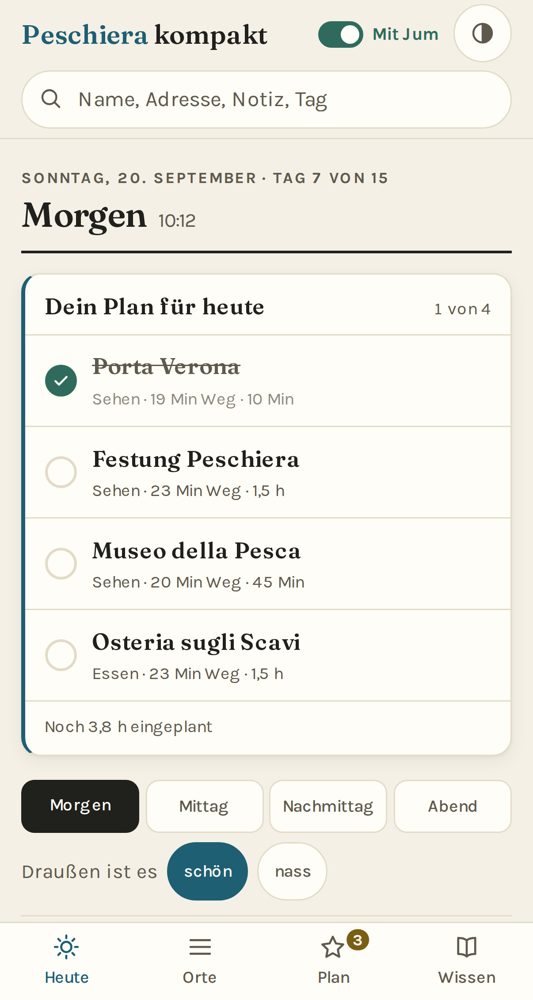 | 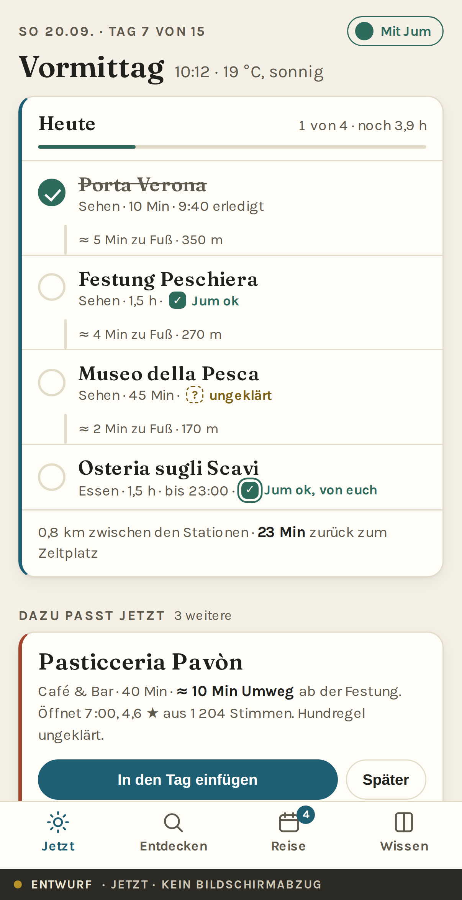 |
| **`ist/01-heute.png` — Screenshot.** Reiter „Heute" am 20.09., 10:12. Tagesplan mit vier Stationen, darunter Abschnittsleiste und Wetterfrage. Der eigentliche Vorschlag steht unter dem Falz. | **`konzept/02-jetzt.png` — Entwurf.** Dieselbe Situation. Neu: Wege zwischen den Stationen, Rückkehrzeit, Hundstatus je Station, und der Vorschlag steht **im Bild** statt darunter. |

### 7.2 Der Kern-Flow: finden → einplanen

| Bestand — echter Bildschirmabzug | Arilica — Entwurf |
|---|---|
| 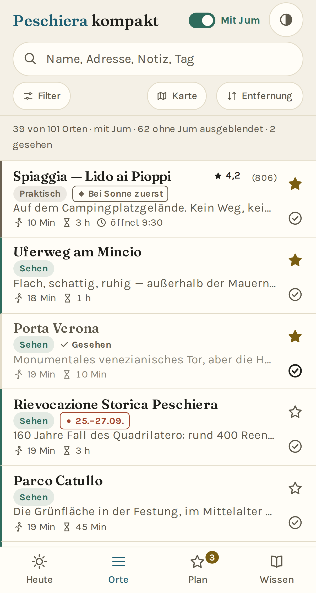 | 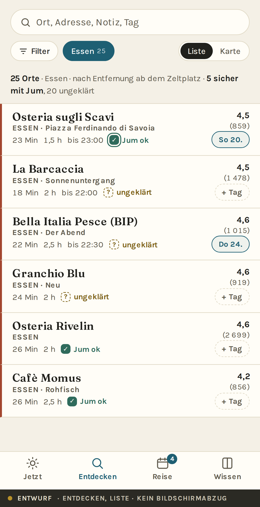 |
| **`ist/02-orte-liste.png` — Screenshot.** Reiter „Orte", Jum an. Die Zählzeile sagt: **„39 von 101 Orten · mit Jum · 62 ohne Jum ausgeblendet"**. 5,6 Zeilen sichtbar. | **`konzept/03-entdecken-liste.png` — Entwurf.** Nichts ist ausgeblendet; die Zählzeile teilt auf („6 sicher mit Jum, 8 ungeklärt"). Rechts unten je Zeile der **Tag-Chip** — der direkte Weg in den Plan. |

| Bestand | Arilica |
|---|---|
| 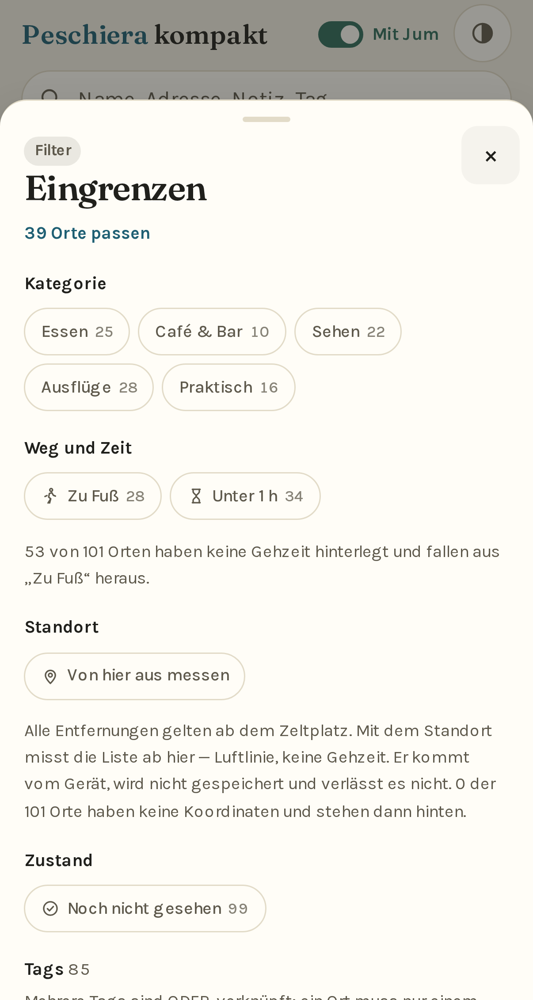 | 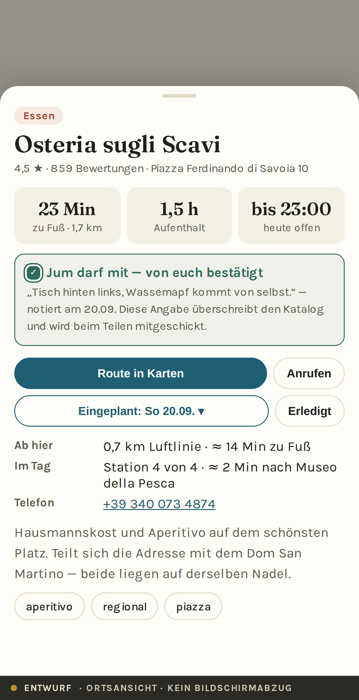 |
| **`ist/04-filter-sheet.png` — Screenshot.** Der Beleg zu P3: Kopf sagt „39 Orte passen", die Kategoriezahlen darunter ergeben 101. | **`konzept/05-ort.png` — Entwurf.** Der Hundstatus trägt Herkunft und Datum und überschreibt den Katalog. Unter „Im Tag" steht die Einordnung in die Route. |

| Bestand | Arilica |
|---|---|
| 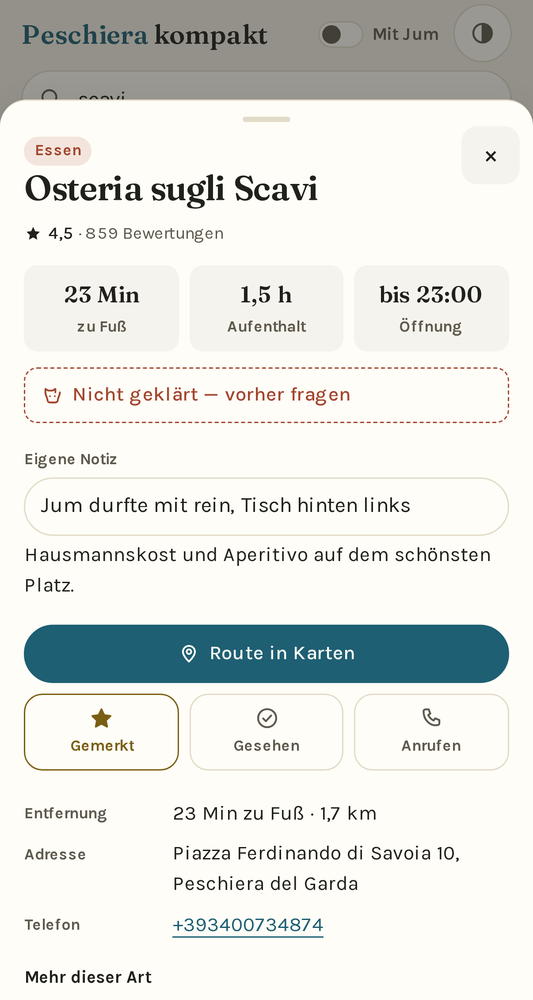 | 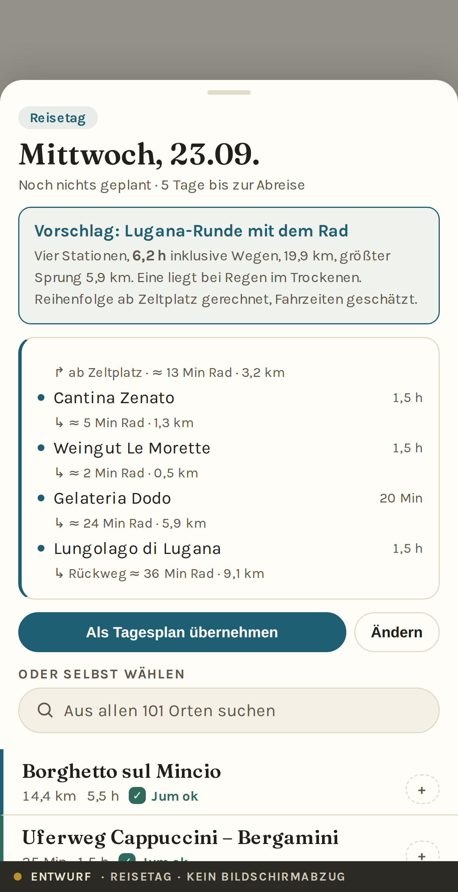 |
| **`ist/05-detail-sheet.png` — Screenshot.** Der Beleg zu P2: „**Nicht geklärt — vorher fragen**" steht direkt über der eigenen Notiz „**Jum durfte mit rein**". | **`konzept/07-reisetag.png` — Entwurf.** Der Tag wird als Ganzes vorgeschlagen, mit Wegen zwischen den Stationen — und die Suche geht über alle 101 Orte, nicht nur über den Vorrat. |

### 7.3 Die zentrale Übersicht

| Bestand — echter Bildschirmabzug | Arilica — Entwurf |
|---|---|
| 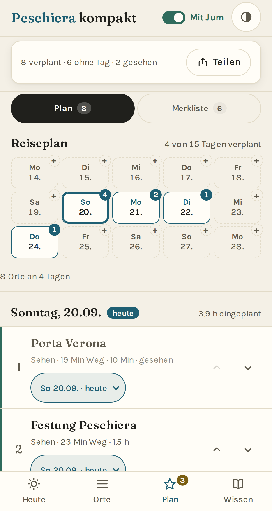 | 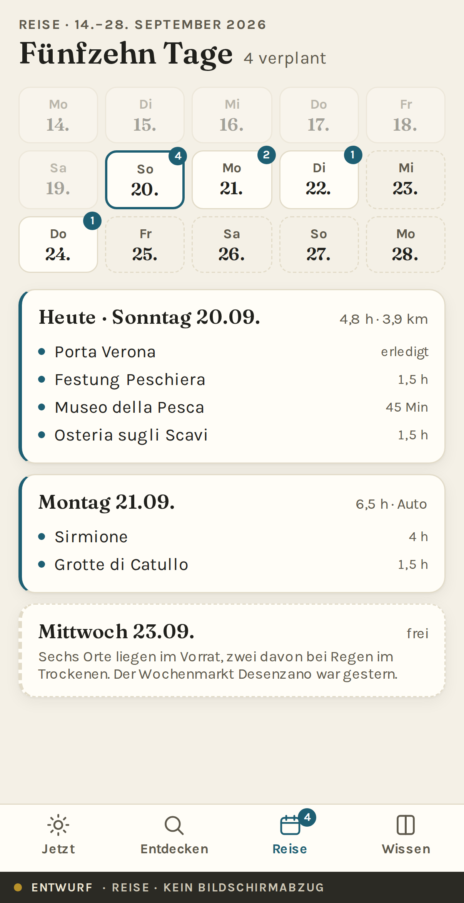 |
| **`ist/06-plan.png` — Screenshot.** Reiseraster über 15 Tage. Zwei Belege im Bild: die Tage **Mo 14. bis Sa 19. tragen ein „+"**, obwohl sie vorbei sind (P5), und die Zeile „**8 Orte an 4 Tagen**" klebt am linken Rand (P10). | **`konzept/06-reise.png` — Entwurf.** Vergangene Tage sind gedämpft und ohne „+". Die Tageskarten zeigen ihre Stationen, die Summen enthalten Wege und nennen das Verkehrsmittel. |

| Bestand | Arilica |
|---|---|
| 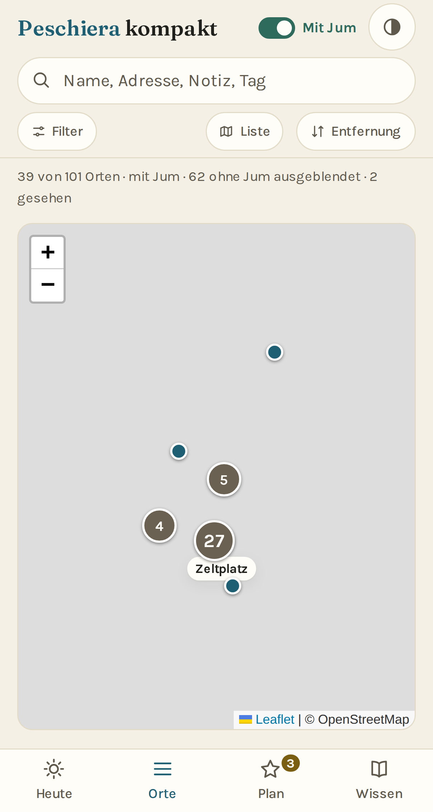 | 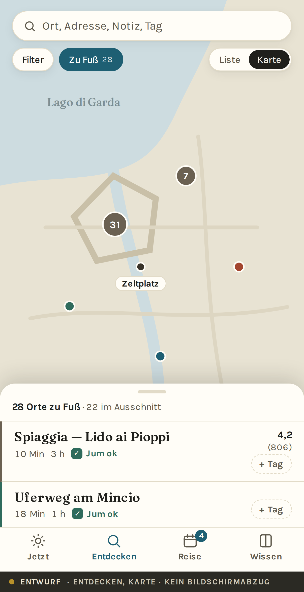 |
| **`ist/03-orte-karte.png` — Screenshot.** Die Karte als Block zwischen Kopf und Tableiste, rund 410 × 400 px nutzbar. **Die Kacheln fehlen, weil der Agent-Proxy fremde Anfragen abbricht** — eine Eigenheit dieser Umgebung, kein Fehler der App. | **`konzept/04-entdecken-karte.png` — Entwurf.** Vollflächig, mit mitgeliefertem Vektorgrund (See, Kanal, Festungsfünfeck) und einem Ergebnis-Sheet mit Rastpunkten. |

### 7.4 Detail- und Abschlusszustände

| Bestand — echter Bildschirmabzug | Arilica — Entwurf |
|---|---|
| 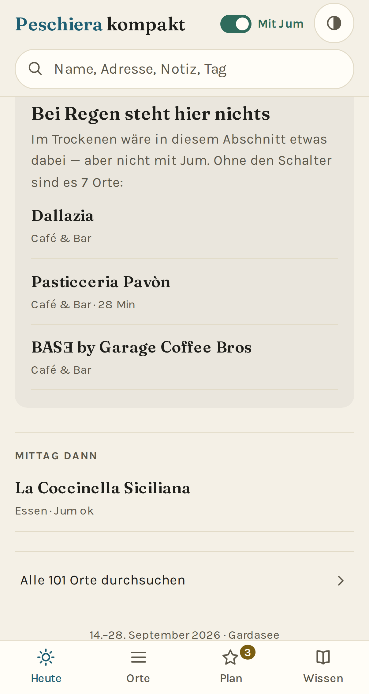 | 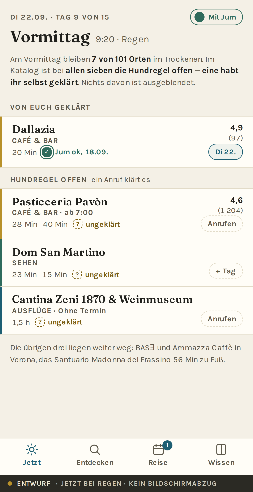 |
| **`ist/16-heute-regen-leer.png` — Screenshot.** Der Beleg zu P1 und S4: **„Bei Regen steht hier nichts."** Darunter nennt die App ehrlich, dass es ohne den Jum-Schalter sieben Orte wären — zeigt aber nur **drei** davon (`wetNoneHtml()` schneidet mit `.slice(0, 3)`). Die drei sind antippbar; die übrigen vier sind von hier aus nicht erreichbar, und einem Tag zuordnen lässt sich keiner. | **`konzept/08-jetzt-regen.png` — Entwurf.** Kein Leerzustand. Zwei Gruppen, alle antippbar, und bei den ungeklärten steht „Anrufen" als vorderste Aktion. |

| Bestand | Arilica |
|---|---|
| 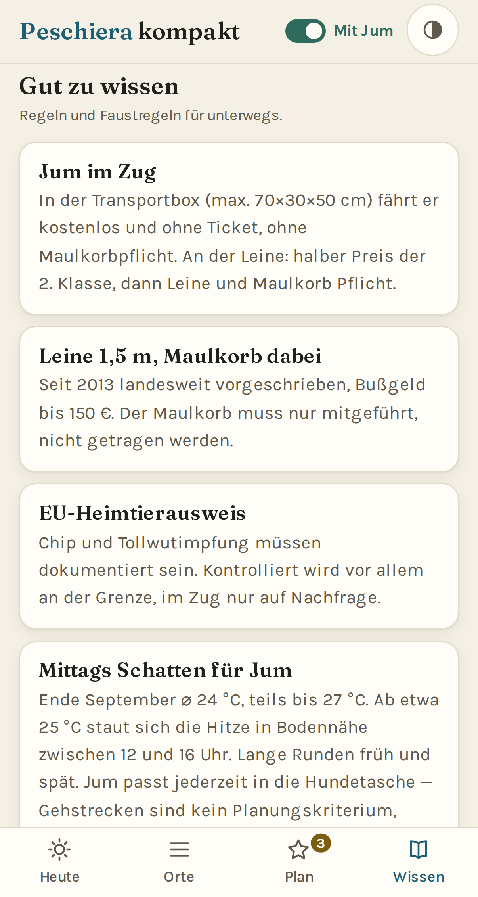 | 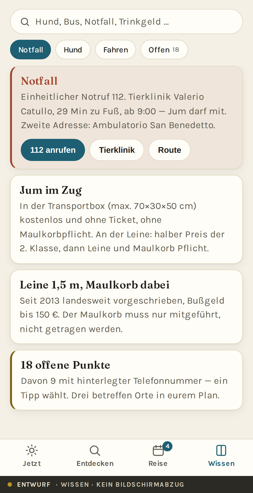 |
| **`ist/09-wissen.png` — Screenshot.** 5 699 px hoch, 48 Einträge, **kein Suchfeld** (P9). | **`konzept/09-wissen.png` — Entwurf.** Suche, Gruppen-Chips und der Notfallblock ganz oben mit Wählknöpfen. |

### 7.5 Erster Start und dunkles Schema

| Arilica — Entwurf | Arilica — Entwurf |
|---|---|
| 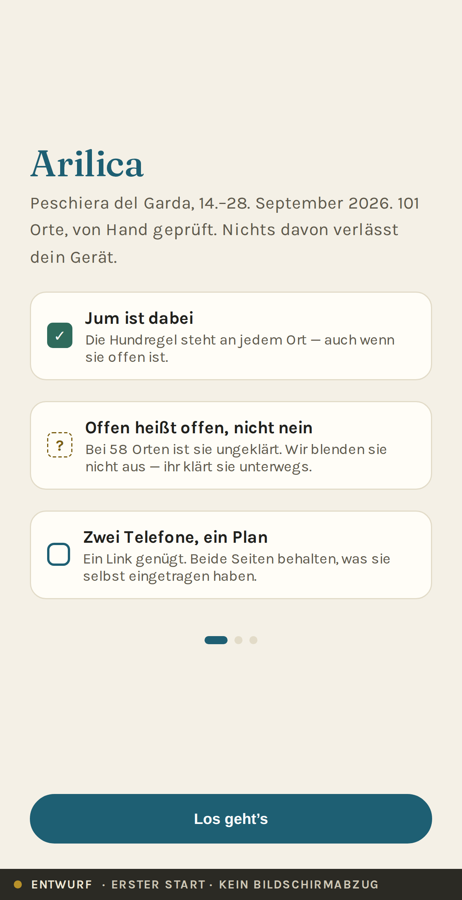 | 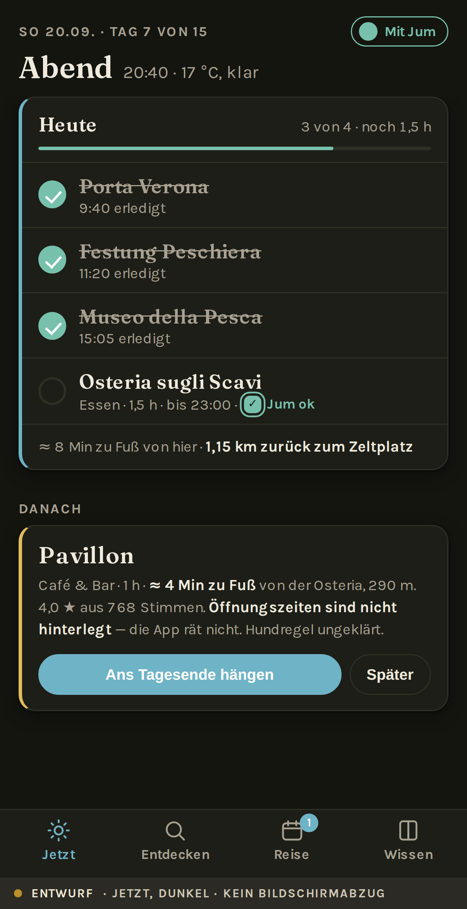 |
| **`konzept/01-start.png` — Entwurf.** Drei Karten erklären die drei Konventionen, nicht die Bedienung. Kein Konto, keine Berechtigungsabfrage. | **`konzept/10-jetzt-dunkel.png` — Entwurf.** Abends, 20:40, drei von vier Stationen erledigt. Zeigt den Fortschrittszustand und die dunkle Palette. |

### 7.6 Weitere Bildschirmabzüge des Bestands

Ohne Gegenüberstellung, als Referenz im Repo:

| Datei | Inhalt |
|---|---|
| `ist/07-tagessheet.png` | Tages-Sheet für Mittwoch — **Beleg zu P4**: „Aus deiner Merkliste 6" |
| `ist/08-merkliste.png` | Merklisten-Hälfte der Planansicht |
| `ist/10-heute-dunkel.png`, `ist/11-orte-dunkel.png` | dunkles Schema im Bestand |
| `ist/12-plan-leer.png` | Planansicht ohne jede Zuordnung |
| `ist/13-heute-regen-jum.png` | Regenzustand oberhalb des Falzes |
| `ist/14-heute-vorschlag.png` | **Beleg zu P7**: „Lido ai Pioppi" zweimal im selben Ausschnitt |
| `ist/15-heute-sonstnoch.png` | „Sonst noch" und „Mittag dann" weiter unten in derselben Ansicht |
| `ist/17-plan-unten.png` | Planzeilen mit Tag-Wähler und Umsortier-Pfeilen; **ein Ortsname wird abgeschnitten** („Wochenmarkt Desenzano (…") |

---

## 8. Technisches Zielbild

### 8.1 Empfohlene Architektur — und warum sie fast dieselbe bleibt

**Empfehlung: Vanilla bleibt. Kein Framework, kein Bundler — aber ES-Module und
ein Build-Schritt, der nur Daten erzeugt.**

Das ist die unbequemere Empfehlung, deshalb die Begründung zuerst:

| Für ein Framework spräche | Dagegen spricht |
|---|---|
| 4 106 Zeilen in einer IIFE sind viel | Sie sind sauber gegliedert und dicht kommentiert; die Größe ist kein Schmerz, den ein Framework nähme |
| Zustandsverwaltung von Hand | `S` ist ein flaches Objekt mit 25 Feldern. Ein Store wäre mehr Zeremonie als Gewinn |
| Komponenten wären wiederverwendbar | `cardHtml()`, `tile()`, `row()` sind bereits Komponenten — nur als Funktionen |
| | **Der Build ist heute null.** Ein Bundler brächte Werkzeugketten, Abhängigkeiten, CVEs und Wartung in ein Projekt, das 15 Tage lang funktionieren muss |
| | **105 ms First Paint.** Die zu unterbieten ist mit React oder Vue nicht realistisch |
| | **Der Prüfstand hängt daran**: `app.js` reicht am Ende seine reinen Helfer an `module.exports`, was im Browser nichts tut. Das ist ein guter Trick, der mit einem Bundler verschwindet |

**Was sich ändert:**

```
arilica/
├─ index.html
├─ app/
│   ├─ main.js            Start, Router, Zustand
│   ├─ state.js           S + Persistenz + Migration
│   ├─ data.js            Laden, Indizes, Ableitungen (hoursWindow, momentsOf …)
│   ├─ plan.js            Tage, Zuordnung, Reihenfolge, Zeit- und Wegbudget
│   ├─ views/             jetzt.js · entdecken.js · reise.js · wissen.js
│   ├─ ui/                zeile.js · sheet.js · chips.js · karte.js
│   └─ lib/               geo.js · zeit.js · text.js · store.js
├─ data/
│   ├─ places.json        wie heute, erweitertes Schema (8.2)
│   ├─ trip.json          NEU: getippter Reisezeitraum statt Freitext-Parsing
│   ├─ matrix.bin         NEU: Entfernungsmatrix, zur Bauzeit erzeugt (8.3)
│   └─ wissen.json        NEU: aus places.json herausgelöst, durchsuchbar
├─ karte/basis.svg        NEU: Vektorgrund für Offline
└─ scripts/               Prüfstand + Erzeuger (matrix, icons, mockups)
```

**ES-Module statt einer IIFE**, weil `<script type="module">` auf dem Zielgerät
selbstverständlich ist und weil `test-logic.mjs` dann direkt importieren kann,
statt den `module.exports`-Trick zu brauchen. **Preis, ehrlich benannt:**
`file://` funktioniert mit Modulen **nicht** mehr. Das kostet den Fall
„Datei doppelklicken" — den die App heute ohnehin nur abfängt, um einen
Serverbefehl anzuzeigen.

### 8.2 Zentrale Datenmodelle

#### `Place` — Erweiterung, keine Ablösung

Das heutige Schema bleibt. Vier Felder kommen dazu, eines wird präzisiert:

```jsonc
{
  "id": "scavi",                      // unverändert, nie ändern
  "name": "Osteria sugli Scavi",
  "category": "essen",
  "note": "Hausmannskost und Aperitivo auf dem schönsten Platz.",
  "address": "Piazza Ferdinando di Savoia 10, Peschiera del Garda",
  "phone": "+393400734874",
  "rating": 4.5, "reviews": 859,

  "hours": "geöffnet bis 23:00",      // weiterhin Freitext …
  "opening": {                        // NEU, optional: was daraus belegt ist
    "closed_on": ["mi"],
    "windows": [{ "days": "*", "from": "18:30", "to": "23:00" }],
    "source": "google", "checked": "2026-09-17"
  },

  "dog": { "value": null,             // WAR: true|false|null
           "source": "katalog" },     // NEU: katalog | vor_ort | geteilt

  "geo": { "lat": 45.4382, "lon": 10.6906 },
  "walk_min": 23, "distance_km": 1.7, "bike_min": null,
  "time_min": 90, "time_label": "1–1,5 h",
  "moment": ["abend"],
  "indoor": true,                     // soll ausdrücklich gesetzt werden
  "tags": ["bummeln", "stadt", "aperitivo"],
  "badge": null,
  "connection": null
}
```

**Begründungen:**

- **`dog` wird ein Objekt.** Nur so kann die Herkunft mitreisen (P2). Die
  Migration ist trivial: `true` → `{value:true, source:"katalog"}`.
- **`opening` ergänzt `hours`, ersetzt es nicht.** Die bestehende Regel „lies
  nur, was eindeutig dasteht" bleibt gültig; `opening` ist der Ort, an dem das
  Ergebnis der Lesung **einmal** festgehalten wird, statt bei jedem Rendern neu
  geraten zu werden. Wo `opening` fehlt, greift die heutige Logik.
- **`indoor` soll ausdrücklich gesetzt werden** — heute bei 1 von 101. Das ist
  eine **Datenaufgabe**, kein Code, und sie ist billig: 101 Zeilen.

#### `Trip` — neu

```jsonc
{ "from": "2026-09-14", "to": "2026-09-28",
  "base": { "name": "Campeggio del Garda", "geo": {...} },
  "travellers": ["Mensch", "Mensch"], "dog": { "name": "Jum" } }
```

Ersetzt das Parsen von `meta.subtitle` (`tripSpan()`, `app.js:1602`). Der
Prüfstand hat dafür heute eigene Zusicherungen — die entfallen, weil die Klasse
Fehler entfällt.

#### `Zustand` — im Gerät

```jsonc
{ "v": 2,
  "places": {
    "scavi": { "day": "2026-09-20", "pos": 4, "done_at": null,
               "dog": { "value": true, "at": "2026-09-20T19:44:00+02:00" },
               "note": { "text": "Tisch hinten links", "at": "2026-09-20T19:44:00+02:00" } },
    "sirmione": { "day": "2026-09-21", "pos": 1 },
    "bip":  { "day": null }                       // Vorrat
  },
  "prefs": { "jum": true, "theme": "auto" } }
```

**Ein Eintrag je Ort statt vier paralleler Strukturen** (`pk.saved`, `pk.seen`,
`pk.notes`, `pk.days`). Jedes veränderbare Feld trägt `at` — das ist die
Grundlage der feldweisen Zusammenführung (4.3, F5). Die Migration aus `pk.*`
läuft einmal beim ersten Start und ist verlustfrei.

### 8.3 Die Entfernungsmatrix — der technische Kern der Neuerung

**Das Problem (P6):** Ohne Wegzeiten zwischen beliebigen Orten kann der Plan
weder eine ehrliche Tagessumme noch eine Reihenfolge anbieten. Alle heutigen
Werte gelten ab dem Zeltplatz, und `walk_min` fehlt bei 53 Orten.

**Der Vorschlag:** Eine zur **Bauzeit** erzeugte Matrix über alle 101 Orte.

- 101 × 101 = **10 201 Paare**, symmetrisch also **5 050 Werte**.
- Je Paar: Luftlinie (`Uint16`, Meter) + Modus-Kennung. Rund **12 kB** als
  Binärdatei, etwa 40 kB als JSON (**Schätzung**).
- **Zur Laufzeit wird nur gelesen, nie gerechnet und nie abgefragt.** Offline
  bleibt offline.

**Von Luftlinie zu Wegzeit.** Die Grundlage liegt bereits im Repo:
`test-logic.mjs` rechnet für die 48 Orte mit gemessenem Fußweg einen
**Umwegfaktor Straße/Luftlinie von median 1,50** aus. Damit:

```
weg_m ≈ luftlinie_m × 1,50
zu Fuß   ≈ weg_m / 4,5 km/h      (mit Hund, mit Pausen)
mit Rad  ≈ weg_m / 15 km/h
mit Auto ≈ weg_m / 45 km/h + 10 min Parken
```

**Zwei Ehrlichkeitsregeln, die mitgeliefert werden müssen:**

1. **Geschätzte Zeiten werden als geschätzt ausgewiesen** („≈ 12 Min"), gemessene
   nicht. Das ist dieselbe Beweislast, die `hoursWindow()` schon trägt.
2. **Über 8 km wird nicht mehr zu Fuß gerechnet.** Ein Tag mit Verona ist ein
   Autotag; die Matrix sagt das, statt 4 Stunden Fußweg zu behaupten.

**Reihenfolgevorschlag.** Bei höchstens 8 Stationen je Tag ist die Route exakt
lösbar (7! = 5 040 Permutationen ab festem Start, unter 5 ms). Darüber:
Nächster-Nachbar plus 2-opt. **Kein Fremdpaket** — dieselbe Begründung wie beim
Bündeln der Nadeln in `v25`, wo die naive Schleife bei 101 Punkten unter einer
Millisekunde brauchte.

Damit ist der Punkt „**Sortierung nach kürzester Runde**" aus dem Abschnitt
„Später angedacht" der README erledigt — und zwar so, dass er offline
funktioniert.

### 8.4 Benötigte APIs und Integrationen

| Was | Woher | Netz nötig? |
|---|---|---|
| Ortsdaten, Wissen, Matrix, Kartengrund | eigenes Repo | **nein** |
| Gerätestandort | `navigator.geolocation` | **nein** (GPS) |
| Route starten | `maps://`-Link ins System | ja, aber erst nach dem Tippen |
| Anrufen | `tel:` | — |
| Teilen | `navigator.share`, sonst Zwischenablage | nein |
| Kartenkacheln | OpenStreetMap | ja — **optional**, Vektorgrund trägt offline |
| Wetter | **weiterhin gefragt, nicht abgerufen** | nein |

**Zum Wetter, ausdrücklich.** Es wäre naheliegend, eine Wetter-API anzubinden.
**Empfehlung: nicht tun.** Gründe: Es wäre der erste fremde Request seit `v23`;
es bräche das Offline-Versprechen genau dann, wenn es zählt; und der Nutzer
schaut ohnehin aus dem Fenster. Die zwei Knöpfe „schön / nass" kosten einen Tipp
und sind immer richtig.

**Ein Zugeständnis (Vorschlag):** Wenn beim Start Netz da ist, darf die App
eine Vorhersage für den Tagesabschnitt **vorbelegen** — sichtbar als Vorschlag,
jederzeit überschreibbar, und bei fehlendem Netz fällt sie stumm auf die Frage
zurück. Das ist eine Produktentscheidung, keine technische; sie gehört in 10.2.

### 8.5 Zustandsverwaltung

Ein einziges Zustandsobjekt, ein `set()`, ein `render()` je Ansicht. Drei
Regeln aus dem Bestand werden zu Architekturregeln erhoben:

1. **Teil-Neuzeichnen, wo der Fokus zählt.** Beim Abhaken wird nur der Block neu
   gebaut und der Fokus zurückgesetzt (bestehende `v29`-Entscheidung, richtig).
2. **Was nicht überleben soll, wird nicht gespeichert.** Der Gerätestandort ist
   nach dem nächsten Spaziergang falsch. Welche Hälfte des Plans offen war, ist
   keine Einstellung. Beides bleibt flüchtig.
3. **Jeder Speicherzugriff in `try/catch`**, über den Namen, nicht über eine
   Referenz — `window.localStorage` selbst wirft in manchen
   Privatsphäre-Einstellungen.

### 8.6 Offline-, Fehler- und Ladeverhalten

| Lage | Verhalten |
|---|---|
| Erster Start, online | App-Shell + Daten + Matrix in den Cache, Gerüst sofort |
| Zweiter Start, offline | vollständig aus dem Cache, **kein** Hinweis (es ändert nichts) |
| Offline, Karte geöffnet | Vektorgrund + Nadeln + einzeiliger Hinweis |
| Neue Fassung verfügbar | wie heute: Seite lädt einmal neu, sobald die neue Fassung übernimmt |
| `CACHE` ≠ `VERSION` | Warnung im Fuß (bestehende Lösung, richtig und selten genug) |
| Daten nicht ladbar | Gerüst weg, Klartext + „Erneut versuchen" (bestehend) |
| `localStorage` weggeräumt | **neu:** einmalig anbieten, aus einem Teilen-Link wiederherzustellen |

**Zur Safari-Räumung** (die harte Grenze aus 2.6): Sie lässt sich nicht
verhindern, aber ihre Folgen lassen sich abfedern. **Vorschlag:** Der Plan wird
zusätzlich **in die Adresse geschrieben** — derselbe `#liste=`-Mechanismus, der
schon fürs Teilen existiert. Wer die App als Lesezeichen ablegt, trägt seinen
Plan im Lesezeichen. Kostet nichts, braucht keinen Server, und ein Lesezeichen
überlebt eine Speicherräumung.

### 8.7 Datenschutz und Sicherheit

**Der Bestand ist hier vorbildlich und wird unverändert übernommen:** keine
Cookies, kein Tracking, keine fremden Requests, kein Konto, keine Analytik. Der
Standort kommt vom Gerät, wird nirgends gespeichert und verlässt es nicht.

**Drei Punkte, die die Neuentwicklung beachten muss:**

1. **Der Teilen-Link enthält personenbezogene Beobachtungen.** Schon heute
   reisen eigene Notizen mit; künftig kämen Hundstatus und Zeitstempel dazu.
   Er geht über iMessage oder AirDrop, also über Kanäle, die der Nutzer wählt —
   aber die Oberfläche sollte vor dem Teilen **sagen, was drinsteht**, statt es
   nur zu tun.
2. **Kartenkacheln sind der einzige fremde Request.** Sie melden die grobe
   Position an OpenStreetMap. Das ist vertretbar und soll **beim ersten Öffnen
   der Karte einmal gesagt** werden — nicht in einem Banner, sondern als Zeile
   unter der Karte, mit einem Schalter „nur Vektorgrund".
3. **Keine Analytik, auch keine „anonyme".** Es gibt keinen Adressaten.

### 8.8 Risiken, Annahmen und offene technische Fragen

| # | Risiko / Annahme | Bewertung | Gegenmaßnahme |
|---|---|---|---|
| R1 | **Die geschätzten Wegzeiten sind falsch** und der Plan wird unzuverlässiger statt besser | mittel | Faktor aus echten Daten (1,50), Kennzeichnung „≈", Prüfstand gegen die 48 gemessenen Fußwege |
| R2 | **`file://` geht mit ES-Modulen verloren** | klein | heute schon nur ein Fehlerhinweis; in der README dokumentieren |
| R3 | **Vektorgrund ist Handarbeit** und veraltet | klein | Ein Grund ohne Straßennamen veraltet kaum; Kacheln legen sich darüber |
| R4 | **Feldweise Zusammenführung ist schwerer als sie aussieht** (Uhren gehen falsch) | mittel | Reihenfolge nach Zeitstempel, bei Gleichstand gewinnt das eigene Gerät; Konflikte anzeigen statt still auflösen |
| R5 | **Der Datenaufwand wird unterschätzt**: 58 Hundregeln, 100 `indoor`, 47 fehlende `hours` | **hoch** | Genau deshalb ist die Vor-Ort-Korrektur ein Produktfeature und keine Datenaufgabe |
| R6 | **iOS Safari bleibt ungeprüft** — die Entwicklungsumgebung hat keines | **hoch** | `selbsttest.html` ausbauen; die Browser-Suiten prüfen Bedingungen, nicht Trefferproben (bestehende, richtige Lehre aus `v26`) |
| R7 | **Annahme:** Beide Reisenden wollen denselben Plan | mittel | Vor der Umsetzung klären (10.3) |
| R8 | **Annahme:** Die App wird als Browserseite genutzt, nicht installiert | belegt für heute | Nichts bauen, was Installation voraussetzt — bestehende Hausregel |

### 8.9 Was übernommen wird und was ersetzt wird

**Unverändert übernehmen — es ist gut und teuer erarbeitet:**

| Baustein | Warum |
|---|---|
| `data/places.json` inklusive aller Inhalte | 101 geprüfte Orte, Faktencheck, Provenienz — das ist das Produkt |
| Die Freitext-Leser (`hoursWindow`, `closedOn`, `momentsOf`, `indoorOf`, `runsToday`, `fitsLeft`, `unverified`) | Jeder ist gegen reale Schreibweisen geprüft |
| Der komplette Prüfstand, beide Suiten | 582 Zusicherungen; Layout darf sie brechen, Zusicherungen nicht |
| Die iOS-Safari-Behandlung (`onTap`, Wischschwelle, `dvh`, Safe Areas, `inert`, Body-Fixierung, Stapelkontext auf `.map`) | Jede Zeile davon ist die Antwort auf einen echten Fehler |
| Schriften, Farbmarken, Typoleiter, Gerüst-Ladezustand | siehe 6.1 |
| Leaflet lokal, Bündelung ohne Fremdpaket | aus Messungen entstanden |
| Teilen über `#liste=` | funktioniert ohne Server |
| Service Worker samt Fassungsabgleich | die Warnung im Fuß statt in der Konsole ist die richtige Lösung |

**Ersetzen:**

| Heute | Künftig | Grund |
|---|---|---|
| `pk.saved` + `pk.seen` + `pk.notes` + `pk.days` | ein Eintrag je Ort mit Zeitstempeln | P4, P11 |
| `dog: true\|false\|null` | `dog: {value, source}` | P1, P2 |
| Jum als Filter (`app.js:993`) | Jum als Sortier- und Beschriftungsbrille | P1 |
| `catCount`/`flagCount` gegen `D.places` | gegen die wirklich angezeigte Menge | P3 |
| `tripSpan()` parst `meta.subtitle` | `trip.json` | Fehlerklasse entfällt |
| Wissen in `places.json` (`merken`, `open_questions`, `faktencheck`) | `wissen.json`, durchsuchbar, gruppiert | P9 |
| Karte als Block | Karte als Fläche + Vektorgrund | P12 |
| Zeitsumme ohne Wege | Zeit- und Wegbudget aus der Matrix | P6 |
| `.plan__sum` ohne Innenabstand | Abstand wie alle Geschwister | P10 |
| 4 106 Zeilen in einer IIFE | ES-Module | Wartbarkeit, direkter Import im Prüfstand |

**Bewusst nicht anfassen:** die Entscheidung gegen ein Framework, gegen einen
Server, gegen Fotos, gegen eine Wetter-API und gegen alles, was Installation
voraussetzt.

---

## 9. Umsetzungsplan

### 9.1 MVP — was in der ersten Fassung steht

**Leitfrage:** Was muss drin sein, damit die App am ersten Reisetag *besser*
ist als `v33` — nicht *vollständiger*?

| # | Arbeitspaket | Löst | Aufwand |
|---|---|---|---|
| **M1** | **Datenmodell + Migration**: `dog` als Objekt, ein Zustandseintrag je Ort, `trip.json`, verlustfreie Übernahme aus `pk.*` | Grundlage | M |
| **M2** | **Jum wird Brille**: nichts ausblenden, sortieren und beschriften, Zählzeile dreiteilig | P1 | S |
| **M3** | **Hundstatus vor Ort setzen**, mit Herkunft und Datum; Anzeige in Zeile und Sheet | P2, S5 | M |
| **M4** | **Tag-Chip an jeder Ortszeile** und im Sheet; `setDay` von überall | P4 | M |
| **M5** | **Jetzt** als zusammengeführte Ansicht (Tagesplan + Vorschlag), „Plan" verliert die Doppelung | P7 | L |
| **M6** | **Reise** mit Tageskarten, vergangene Tage nicht planbar | P5 | M |
| **M7** | **Filterzahlen stimmen** | P3 | S |
| **M8** | **`.plan__sum`-Abstand** | P10 | XS |
| **M9** | **Prüfstand nachziehen**: Zusicherungen für M2, M3, M4, M7 | Absicherung | M |

**Nicht im MVP** — und das ist eine Entscheidung, keine Auslassung:
Entfernungsmatrix, Reihenfolgevorschlag, vollflächige Karte, Vektorgrund,
Wissen-Umbau, feldweise Zusammenführung. Begründung: M1–M9 beheben die Fehler,
die den Bestand *falsch* machen. Alles andere macht ihn *besser*. In dieser
Reihenfolge.

### 9.2 Ausbaustufen

**Stufe 2 — der Plan wird ein Plan** *(setzt M1, M4, M6 voraus)*

| # | Paket | Löst |
|---|---|---|
| A1 | **Entfernungsmatrix** erzeugen (`scripts/make-matrix.mjs`), Format, Laderoutine | Grundlage |
| A2 | **Wege in der Tageskarte und in den Summen**, Kennzeichnung „≈" | P6 |
| A3 | **Reihenfolgevorschlag** je Tag (exakt ≤ 8 Stationen, sonst 2-opt) | README „Später angedacht" |
| A4 | **Begründete Vorschläge** in *Jetzt* („3 Min Umweg") | S2 |
| A5 | **Suche im Tages-Sheet über alle 101 Orte** | P4, Rest |

**Stufe 3 — Fläche und Wissen**

| # | Paket | Löst |
|---|---|---|
| B1 | **Karte vollflächig**, Sheet mit Rastpunkten | P12 |
| B2 | **Vektorgrund** `karte/basis.svg`, auch im Dunkeln | P12, Offline |
| B3 | **Wissen**: `wissen.json`, Suche, Gruppen, Notfall gepinnt | P9 |
| B4 | **Globale Suche** deckt Orte, eigene Notizen und Wissen ab | P2, P9 |

**Stufe 4 — zu zweit**

| # | Paket | Löst |
|---|---|---|
| C1 | **Feldweise Zusammenführung** über Zeitstempel; „Meine ersetzen" entfällt | P11 |
| C2 | **Plan im Lesezeichen** (`#liste=` beim Speichern) | Safari-Räumung |
| C3 | **Vor dem Teilen sagen, was drinsteht** | 8.7 |

**Stufe 5 — Barrierefreiheit und Feinschliff**

| # | Paket |
|---|---|
| D1 | **Dynamic Type**: Root an `-apple-system-body`, Umbruch bei 200 % geprüft |
| D2 | **`prefers-reduced-motion`** durchgängig |
| D3 | **Nicht-Text-Kontraste** ≥ 3 : 1 im Prüfstand |
| D4 | **`lang="it"`** an italienischen Eigennamen |
| D5 | **Onboarding** (drei Karten) |

### 9.3 Abhängigkeiten

```
M1 (Datenmodell)
 ├─▶ M2 (Jum-Brille) ──▶ M7 (Filterzahlen)
 ├─▶ M3 (Hundstatus vor Ort) ──▶ C1 (Zusammenführung)
 ├─▶ M4 (Tag-Chip) ──┬─▶ M5 (Jetzt) ──▶ A4 (begründete Vorschläge)
 │                   └─▶ M6 (Reise) ──▶ A2/A3 (Wege, Reihenfolge)
 └─▶ C2 (Plan im Lesezeichen)

A1 (Matrix) ──▶ A2 ──▶ A3 ──▶ A4
B1 (Karte) ──▶ B2 (Vektorgrund)
B3 (wissen.json) ──▶ B4 (globale Suche)

M8, M9, D1–D5  — unabhängig, jederzeit
```

**Der kritische Pfad ist `M1 → M4 → M6 → A1 → A2 → A3`.** Wer A1 vorzieht,
bevor M1 steht, baut die Matrix gegen ein Schema, das sich noch ändert.

### 9.4 Erfolgskriterien und messbare Metriken

Alle Zielwerte sind gegen den **gemessenen Stand von `v33`** gesetzt.

#### Produkt

| Metrik | `v33` | Ziel | Wie gemessen |
|---|---|---|---|
| **Erreichbare Orte bei eingeschaltetem Jum** | **39 / 101** | **101 / 101**, davon 39 als „sicher" markiert | Zählzeile |
| **Orte, die vom Tages-Sheet aus planbar sind** | **6 / 101** (Beispielstand) | **101 / 101** | Sheet-Suche |
| **Tipps: Ort finden → auf einen Tag legen** | **6**, einer davon ein Reiterwechsel | **2** | ausgezählt am Ablauf |
| **Tipps: leeren Tag füllen** | ≥ 6 | **1** (Vorschlag übernehmen) | ausgezählt |
| **Leerzustände ohne Ausweg** | **1** (Regen + Jum) | **0** | Prüfstand |
| **Ungeklärte Hundregeln** | **58** | nach 15 Tagen **< 40** (**Annahme**: ~1,5 Klärungen/Tag) | Zähler in *Wissen* |
| **Sichtbare Listenzeilen** | 5,6 | **≥ 7** | gemessen |

#### Technik

| Metrik | `v33` | Ziel |
|---|---|---|
| Zeit bis zur sichtbaren App, lokal, kalter Cache | **105 ms** | **≤ 150 ms** — Budget für Matrix und Vektorgrund |
| Fremde Requests beim Start | **0** | **0** — nicht verhandelbar |
| Übertragung beim ersten Rendern, unkomprimiert | **449 kB** (`index.html` 9 + `style.css` 76 + `app.js` 182 + `places.json` 92 + zwei latin-Schriften 90) | **≤ 520 kB** — Budget für Matrix und Vektorgrund |
| Prüfungen im Prüfstand | **582** | **≥ 650** |
| Alle Prüfungen grün | ja | ja — Bedingung für jede Zusammenführung |
| Abweichung geschätzter vs. gemessener Fußweg | — | **Median ≤ 20 %** gegen die 48 belegten Werte |

#### Nutzung — nur privat und ohne Telemetrie erhebbar

Es gibt keine Analytik und soll keine geben. Diese Werte werden am Ende der
Reise **von Hand** beantwortet — das ist bei einem Haushaltsprodukt kein
Rückschritt, sondern die einzige ehrliche Methode:

- Wie viele der 15 Tage wurden tatsächlich vorab geplant? *(Ziel: ≥ 10)*
- Wie oft wurde ein Tagesvorschlag unverändert übernommen? *(Ziel: ≥ 3)*
- Wie viele Hundregeln wurden vor Ort geklärt? *(Ziel: ≥ 18)*
- Musste jemand „Meine ersetzen" vermissen? *(Ziel: nein)*

### 9.5 Vorgeschlagene Reihenfolge

| Schritt | Inhalt | Ergebnis |
|---|---|---|
| **1** | M1 + M9 (Modell und Prüfstand zuerst) | Nichts sichtbar, alles darauf aufbaubar |
| **2** | M2 + M7 + M8 | **Die App zeigt wieder 101 Orte.** Der größte Einzelgewinn |
| **3** | M3 | Aus 58 blinden Flecken wird ein Arbeitsvorrat |
| **4** | M4 | Die Merkliste hört auf, ein Tor zu sein |
| **5** | M5 + M6 | Eine Ansicht je Frage |
| **6** | A1 + A2 | Tagessummen stimmen |
| **7** | A3 + A4 + A5 | Der Plan schlägt vor, statt nur zu verwalten |
| **8** | B1 + B2 | Die Karte wird ein Werkzeug |
| **9** | B3 + B4 | Wissen wird auffindbar |
| **10** | C1–C3 | Zwei Telefone, ein Plan |
| **11** | D1–D5 | Barrierefreiheit und erster Start |

**Nach jedem Schritt ist die App lauffähig und besser als vorher.** Kein
Schritt setzt einen späteren voraus. Schritt 2 allein rechtfertigt schon den
Aufwand: Er verdoppelt den nutzbaren Bestand.

---

## 10. Entscheidungen und offene Fragen

### 10.1 Die wichtigsten Entscheidungen, mit Begründung

| # | Entscheidung | Begründung | Preis |
|---|---|---|---|
| **E1** | **Der Jum-Schalter blendet nichts mehr aus** | 58 der 62 ausgeblendeten Orte sind nicht verboten, sondern ungeklärt. Ein Dauerschalter darf keine Datenlücke in eine Tatsache verwandeln | Die Liste wird länger. Aufgefangen durch Gruppen und Sortierung |
| **E2** | **Die Beobachtung vor Ort überschreibt den Katalog** | Sonst steht „nicht geklärt" über „Jum durfte mit rein" (Bild `ist/05-detail-sheet.png`) | Zwei Wahrheiten im Modell. Aufgefangen durch sichtbare Herkunft und Datum |
| **E3** | **Die Merkliste wird optional** | `setDay` ist heute nur über `S.saved` erreichbar — der Stern ist ein Tor, kein Merkmal | Der Vorrat verliert Prominenz. Er behält seine Sektion |
| **E4** | **Vier Reiter bleiben** | Vier echte Fragen (3.2). Fünf ließen je 80 px; drei versteckten eine Frage | Keiner |
| **E5** | **Kein Framework, kein Bundler** | 105 ms First Paint, null Abhängigkeiten, ein Prüfstand, der am Aufbau hängt | Mehr Handarbeit an der Oberfläche |
| **E6** | **ES-Module statt einer IIFE** | Direkter Import im Prüfstand, Gliederung ohne Bundler | `file://` fällt weg |
| **E7** | **Wetter bleibt gefragt, nicht abgerufen** | Erster fremder Request seit `v23`, und ausgerechnet der bräche offline | Ein Tipp pro Sitzung |
| **E8** | **Entfernungen geschätzt statt geroutet** | Ein Routing-Dienst bräuchte Netz. Der Umwegfaktor 1,50 kommt aus den eigenen 48 gemessenen Fußwegen | Schätzfehler. Aufgefangen durch „≈" und Prüfung gegen die Messwerte |
| **E9** | **Farbe gehört der Kategorie, Zustand trägt Form** | Vier von fünf Kategoriefarben tragen heute eine zweite Bedeutung (P8). Formen skalieren, Farben nicht | Zustände sind auf einen Blick weniger auffällig. Gewinn: sie sind eindeutig |
| **E10** | **Schrift, Farbmarken und Typoleiter bleiben** | Sie sind gemessen (284 → 56 ms), geprüft (≥ 4,5 : 1) und passen zum Inhalt | Keiner |
| **E11** | **Kein Server, auch nicht für die Synchronisierung** | Ein Dienst dazwischen bräche das Offline-Versprechen und die Datenhoheit | Kein Echtzeitabgleich. Feldweise Zusammenführung fängt den Alltag auf |
| **E12** | **Weiterhin keine Fotos** | Keine fairen Lizenzen für 101 Orte, Offline-Budget, falsches Aktualitätsversprechen | Die App bleibt textlastig |
| **E13** | **Einreiseprodukt, keine Mehrreise-App** | Das Produkt ist ein Haushaltsartefakt für 15 Tage. Mehrreisefähigkeit wäre Architektur für einen Nutzer, den es nicht gibt | `trip.json` macht eine spätere zweite Reise trotzdem billig |

### 10.2 Ausdrückliche Annahmen

Diese Aussagen sind **nicht belegt**. Sie stammen aus dem Datenmodell, der
Feature-Historie und der Aufgabenstellung — nicht aus Nutzerforschung.

| # | Annahme | Falls falsch |
|---|---|---|
| **A1** | Zwei Erwachsene reisen mit, beide planen mit | Stufe 4 (C1–C3) entfällt ersatzlos |
| **A2** | Der Hund ist bei **jeder** Entscheidung dabei | Der Schalter würde ein Filter unter vielen — E1 bliebe trotzdem richtig |
| **A3** | Der Zeltplatz ist Basis für die ganze Reise | Ein zweites `base` wäre nötig; die Matrix ändert sich nicht |
| **A4** | Rad und Auto stehen zur Verfügung | Die Modus-Auswahl in A2 entfällt, Fußwege reichen |
| **A5** | Das Gerät bleibt ein iPhone im Safari, ohne Installation | Bestätigt durch die README; wird jährlich neu geprüft |
| **A6** | Ungeklärte Hundregeln lassen sich vor Ort in ~15 Tagen zu etwa einem Drittel klären | Das Ziel in 9.4 wäre zu ehrgeizig; das Feature bliebe richtig |
| **A7** | Der Umwegfaktor 1,50 gilt auch für die 53 Orte ohne gemessenen Fußweg | Gegenprüfung ist eingeplant; Median ≤ 20 % Abweichung ist das Kriterium |
| **A8** | Die Entfernungsmatrix liegt bei etwa 12 kB binär | Geschätzt; notfalls JSON mit ~40 kB, immer noch unkritisch |
| **A9** | Der Vektorgrund lässt sich in 10–15 kB nützlich zeichnen | Geschätzt; notfalls gröber |
| **A10** | Die Zeilenhöhe von ~78 px hält auch mit echtem Text und langen Namen | Am Entwurf gemessen, nicht implementiert |

### 10.3 Fragen, die vor der Umsetzung zu klären sind

**Produkt**

1. **Reisen wirklich zwei Personen mit zwei Geräten?** Davon hängen Stufe 4 und
   das gesamte Zusammenführungsmodell ab. *(A1)*
2. **Soll „Erledigt" an einen Tag gebunden sein oder global bleiben?**
   Tagesbindung ermöglicht eine Rückschau („Was war am Dienstag?"), macht aber
   das Verschieben eines erledigten Ortes erklärungsbedürftig.
3. **Darf die App bei vorhandenem Netz eine Wettervorhersage vorbelegen?** Das
   ist die einzige Stelle, an der die Null-Requests-Regel zur Debatte steht
   (8.4). **Empfehlung: nein**, solange niemand den Nutzen vermisst.
4. **Wie viel Vorschlag ist zu viel?** Der Reihenfolgevorschlag ist nützlich —
   aber wenn er zu selbstbewusst auftritt, plant man nicht mehr selbst. Zu
   klären: Vorschlag *anbieten* oder Reihenfolge *setzen*?

**Daten**

5. **Wer pflegt `indoor` für die 100 offenen Orte?** Das ist ein Nachmittag
   Arbeit und hebt die Regen-Tauglichkeit von 44 belegten auf 101. Ohne diese
   Zusage bleibt S4 halb gelöst.
6. **Sollen `opening`-Fenster von Hand gepflegt werden?** `hours` fehlt bei 47
   Orten. Vollständigkeit ist nicht nötig — aber „öffnet 9:30" ist eine andere
   Qualität als „ungeprüft".
7. **Bleiben 85 Tags, von denen 30 einmalig sind?** Ein Tag, der einen Ort
   beschreibt, ist ein Adjektiv, kein Filter. Zusammenlegen oder aussortieren?

**Technik**

8. **Gibt es Zugang zu einem echten iPhone für die Abnahme?** Das ist die
   größte offene Frage des Projekts (R6) und betrifft schon `v33`.
9. **Welches Format bekommt die Matrix?** Binär ist kleiner, JSON ist
   diffbar und passt zur Repo-Kultur. Empfehlung: **JSON**, solange sie unter
   50 kB bleibt — Diffbarkeit ist hier mehr wert als 28 kB.
10. **Wo kommt der Vektorgrund her?** Aus OSM-Daten ableiten (einmalig, Skript,
    Lizenz beachten) oder von Hand zeichnen? Empfehlung: **ableiten und einmal
    von Hand aufräumen**, wie es `scripts/add-coords.mjs` für die Koordinaten
    vorgemacht hat.

**Vorgehen**

11. **Neuentwicklung oder Umbau in Schritten?** Dieses Dokument ist als
    **Umbau in Schritten** geschrieben (9.5): Jeder Schritt lässt die App
    lauffähig, und der Prüfstand trägt über die ganze Strecke. Eine
    Neuentwicklung auf der grünen Wiese würde 582 Zusicherungen und die
    gesammelten iOS-Lehren wegwerfen. **Empfehlung: Umbau.** Der Name
    „Arilica" markiert dann das Ziel, nicht einen Neuanfang.

---

## Anhang · Herkunft der Zahlen in diesem Dokument

| Zahl | Herkunft |
|---|---|
| 101 Orte, 39/4/58 Hundregeln, 85 Tags, 14 Ruhetage, Umwegfaktor 1,50 | `node scripts/test-logic.mjs`, Ausgabeblock „Zahlen für die README" |
| 178 + 404 = 582 Prüfungen, alle grün | beide Prüfstände am 20.09.2026 ausgeführt |
| Kopfhöhe 147 px, Tableiste 59 px, Zeilenhöhe 97 px, 5,6 sichtbare Zeilen | Playwright-Messung auf 402 × 754 |
| Dokumenthöhen 1 754 / 4 190 / 10 192 / 1 835 / 5 699 px | dieselbe Messung, je Ansicht |
| 105 ms bis zur sichtbaren App | dieselbe Messung: `goto` bis `#app:not([hidden])`, lokaler Server, kalter Cache |
| 65 ohne `rating`, 68 ohne `reviews`, 38 mit `connection`, 41 mit `phone`, 30 einmalige Tags | direkt aus `data/places.json` ausgezählt |
| 449 kB beim ersten Rendern | `du -b` über `index.html`, `style.css`, `app.js`, `places.json` und die beiden latin-Schriften; `latin-ext`, Leaflet (162 kB) und die Icons kommen erst auf Anforderung |
| 284 → 56 ms (Schrift-Umstellung `v23`) | README, Messung des Projekts |
| Zeilenhöhe ~78 px, 7 sichtbare Zeilen im Entwurf | am gerenderten Mockup gemessen — **Entwurfswert** |
| 12 kB Matrix, 10–15 kB Vektorgrund | **Schätzungen**, als solche in 10.2 geführt |

**Umfang der Bilder.** `docs/bilder/` bringt **5,5 MB** ins Repo — 27 PNGs bei
402 × 754 und dreifacher Pixeldichte, also in der echten Auflösung des
Zielgeräts. Das ist bewusst: Bei den Bildschirmabzügen ist die 1:1-Auflösung
eine Eigenschaft des Belegs. Sie werden von der App **nie geladen** — `SHELL`
in `sw.js` führt sie nicht, und aus `index.html` verlinkt nichts dorthin. Die
Regel „nichts Unnötiges beim Start" bleibt damit unangetastet.

**Reproduzieren:**

```bash
node scripts/test-logic.mjs        # Logik und Daten
node scripts/browser/run.mjs       # Verhalten im Browser
node scripts/make-mockups.mjs      # die Entwürfe in docs/bilder/konzept/
```

Die Bildschirmabzüge des Bestands unter `docs/bilder/ist/` wurden mit einem
einmaligen Playwright-Skript erzeugt (Viewport 402 × 754, `deviceScaleFactor`
3, Uhr auf 2026-09-20 10:12 Europe/Rome, Speicher vorbelegt). Das Skript lag im
Arbeitsverzeichnis der Sitzung und ist bewusst **nicht** ins Repo übernommen
worden: Es bildet einen Stand ab, der sich mit der nächsten Fassung ändert,
während die Bilder als Beleg stehen bleiben sollen.
